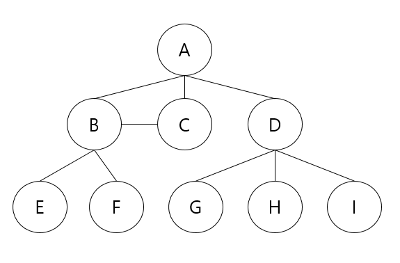
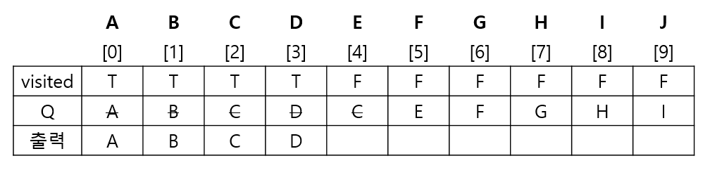
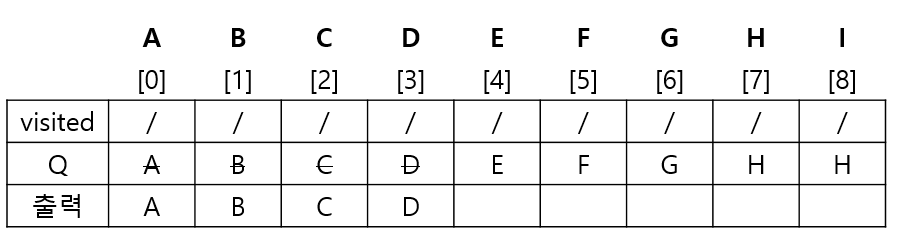

# 큐(Queue)


## 큐의 연산과정

1. 공백 큐 생성 : createQueue();

   ```
   Q = [0] * 100
   front = -1
   rear = -1
   Q를 생성하고 초기화한 상태
   ```

2.  원소 A 삽입 : enQueue(A);

   rear = 마지막 저장위치

   ```
   rear += 1
   Q[rear] = 'A'  #enQ
   ```

3. 원소B삽입 : enQueue(B);

   ```
   rear += 1
   Q[rear] = 'B'
   ```

4. 원소 반환/삭제 : deQueue;

   ```
   front += 1
   data = Q[front]
   return data
   ```

5. 원소 C 삽입 : enQueue(C);


## Q의구현

1. 초기 공백 큐 생성

2. 삽입 : enQueue(item)

   ```
   def enQueue(item):
   	global rear
   	is isFull() : print("Qyeye_Full")
   	else:   #가득 찬 상황이 아니면 집어넣으면 됨.
   		rear <- rear  + 1;
   		Q[rear] <- item;
   ```

3. 삭제 : deQueue()

   ```
   deQueue()
   	if(isEmpty()0 then Queue_Empty();   #비어있는 상황. 디버깅 용도.
   	else{
   		front <- front + 1;   # front가 마지막에 꺼내진 위치. 이전꺼 다음자리 꺼내면 됨.
   		return Q[front];      #삭제되진 않았지만 삭제된거랑 마찬가지
   	}
   ```

4. 공백상태 및 포화상태 검사 : isEmpty(), isFull()

   ```
   def isEmpty() :
   	return == rear   # front랑 rear가 만나면 마지막에 저장된 위치에서 꺼내졌다 = 비어있다
   def Full :
   	return rear == len(Q) - 1 # Q의 마지막 인덱스까지 저장되어 있음. 마지막 인덱스 저장되어있음
   ```

5. 검색 : Qpeek()

   ```
   def Qpeek() :
   	if isEmpty() : print("Queue_Empty")
   	else : return Q[front+1]  # front값 건들지 않고 그 순간에 계산해서 보여줌.
   ```


## 원형 큐

- front 변수 : 공백 상태와 포화 상태 구분을 쉽게 하기 위해 front가 있는 자리는 빈자리로!!

|        |        삽입 위치        |         삭제 위치         |
| :----: | :---------------------: | :-----------------------: |
| 선형큐 |     rear = rear + 1     |     front = front + 1     |
| 원형큐 | rear = (rear + 1) mod n | front = (front + 1) mod n |


1. 공백상태 및 포화상태 검사 : isEmpty(), isFull()

   - 포화상태
     - (rear + 1) mod n = front
     - 하나 더한 값을 크기로 나눈 자리가 front면 가득 찬 상황

   ```
   def isEmpty():
   	return front == rear
   	
   def isFull():
   	return (rear+1) % len(cQ) == front
   ```

   

2. 삽입 : enQueue(item)

   ```
   def enQueue():
   	global rear
   	if isFull() :
   		print("Queue_Full")   #디버깅용.
       else:
       	rear = (rear + 1) % len(cQ)
       	cQ[rear] = item
   ```

   - 현실에서 꽉 찼을 때
     - 먼저 들어온 거 강제로 덮어씌워가며 가기(먼저 들어온 거 지워지는 방식)
     - 나중 들어온 거 버리고 먼저 들어와서 기다리고 있는 것들 유지 
     - 현실에서는 선형 큐를 여러개 놓고 쓰기도 함. 데이터 차면 다른 쪽으로 옮김.

3.  삭제 : deQueue(), delete()

   ```
   def deQueue():
   	global front
   	if isEmpty():
   		print("Queue_Empty")
   	else:
   		front = (front + 1) % len(-Q)
   		return cQ[front]
   ```

4. 구현

   ```
   def isEmpty():
   	return front == rear
   def isFull():
   	return (rear+1) % len(cQ) == front  #rear 다음 칸이 front면 가득 찬 상태
   ```

   

## 연결큐


## 우선순위큐

- 우선순위를 가진 항목들을 저장하는 큐
- 우선순위가 높은 순서대로 먼저 나감.


## BFS 예제

```
def BFS(G, v) :                     #그래프 G, 탐색시작점 v
	visited = [0]*n                 # n : 정점의 개수, 방문표시 배열생성
	queue = []                      #큐 생성
	queue.append(v)                 #시작점 v를 큐에 삽입, 인큐
	while queue:                    #큐가 비어있지 않은 경우
		t = queue.pop(0)            #큐의 첫 번째 원소 반환
		if not visited[t]:          #방문되지 않은 곳이라면
			visited[t] = True       #방문한 것으로 표시
			visit(t)                #정점 t에서 할 일
         	for i in G[t]:          #t와 연결된 모든 정점에 대해
         		if not visited[i]:  #방문되지 않은 곳이라면
         			queue.append(i) #큐에 넣기
```

- 꺼낸 애를 다시 확인하는 이유 : 꺼내서 visited 표시를 하기에 중복이 발생할 수 있음

- 단점 : 중복발생으로 Q사이즈 예측 애매. 
- 중복을 방지할 수 있다면 Q사이즈를 정점의 개수만큼만  확보해놓으면 됨. 


1. 

   

   

   ```
   초기화[
   	큐가 비어 있지 않으면 or 큐가 비워질 때까지 반복
   	while Q not isEmpty():
   	while !isEmptyQ():
   ]
   ```

   ```
   방문하지 않은 v면 visit(v)
   방금꺼낸 v       #반복
   v와 인접하고 방문하지 않은 정점w
   enQ(w)
   
   #반복
   while Q:
   	v <- deQ()
   	visit(v)
   	v의 인접 and 미방문인 모든 w
   	enQ(w)
   ```

   

   ```
   # enqueue와 visited 표시를 묶는 방식. => 중복x. Q의 크기를 정점의 개수만큼만 확보. if문도 줄어듦
   while Q:
   	v <- deQ()
   	do(v)       #정점v에 대해서 처리해야할 작업
   	v에 인접 and 미방문인 모든 w
   	enQ(w)
   	visited[w]<- 1
   ```


- 입력 파라미터 : 그래프 G와 탐색 시작점

  ```
  def BFS(G, v, n) :                           #그래프 G, 탐색시작점 v
  	visited = [0]*(n+1)                      #n : 정점의 개수
  	queue = []                               #큐 생성
  	queue.append(v)                          #시작점 v를 큐에 삽입
  	visited[v] = 1
  	while queue:                             #큐가 비어있지 않은 경우
  		t = queue.pop(0)                     #큐의 첫 번째 원소 반환
  		visit(t)                             #processing의 의미, 방문표시x
  		for i in G[t]:                       #t와 연결된 모든 정점에 대해
          	if not visited[i]:               #방문되지 않은 곳이라면
          		 queue.append(i)             #큐에 넣기
          		 visited[i] = visited[t] + 1 #n으로부터 1만큼 이동
  ```

  |         | A    | B    | C    | D    | E    | F    | G    | H    | I    |
  | ------- | ---- | ---- | ---- | ---- | ---- | ---- | ---- | ---- | ---- |
  | visited | 1    | 2    | 2    | 2    | 3    | 3    | 3    | 3    | 3    |

  - 출발 정점으로부터 최단거리로 이동했을때 edge의 개수 : 2
  - 최소의 edge를 거쳐 도착할 수 있는 거리가  같은 정점은 최대 몇 개인가 : 거리가 같은 애들(3) 최대 5개가 있음. 
  - 가장 멀리있는 정점은 최소 몇개 edge를 거쳐야 도착할 수 있는가 : 2
  - 연결되지 않은 정점은 0인 상태로 남아있도록 해놓고 활용.

- 재귀 구조 사용

  ```
  f(i, g, c)   # i:방문한노드, g:목적지, c:지나온 정점 or edge 개수
  f(1, 4, 0)
  if i == g:
  	if minV > C:
  		minV = C
  else:
  	v[i] = 1
  	for j in adjList[i]:
  		f(j, g, c+1)
  	v[i] = 0
  ```

  

