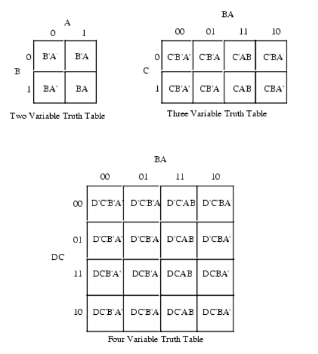
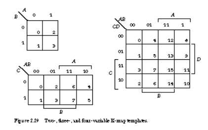

# 1장. 디지털 논리 회로 및 강의 소개

[CSA2021 컴퓨터시스템구조 제 1 장 Part 1]: https://www.youtube.com/watch?v=SG89LOgT7Vc&amp;list=PLc8fQ-m7b1hCHTT7VH2oo0Ng7Et096dYc&amp;index=3
[CSA2021 컴퓨터시스템구조 제 1 장 Part 2]: https://www.youtube.com/watch?v=gn5z3Un_qqM&amp;list=PLc8fQ-m7b1hCHTT7VH2oo0Ng7Et096dYc&amp;index=3


## 목차

1. [디지털 컴퓨터 (Digital Computer)](#1-디지털-컴퓨터)
2. [논리 게이트 (Logic Gates)](#2-논리-게이트)
3. [부울 대수 (Boolean Algebra)](#3-부울-대수)
4. [맵의 간소화 (Karnaugh Map)](#4-맵의-간소화)
5. [조합회로 (Combinational Circuit)](#5-조합회로)
6. [플립플롭 (Flip-Flop)](#6-플립플롭)
7. [순차회로 (Sequential Circuit)](#7-순차회로)


## 1. 디지털 컴퓨터

- 정의
  - 이진 시스템을 사용하여 계산을 수행하는 디지털 시스템
  - 비트의 그룹을 사용하여 숫자, 문자 및 기타 정보를 표시하거나 처리
- 컴퓨터 하드웨어
  - CPU - 중앙처리장치, 컴퓨터 그 자체로 정의, 산술 논리 처리와 데이터의 저장, 제어 기능 수행
  - 주변장치 - 메모리(RAM/ROM), 저장 장치(STORAGE), 입출력 장치(IO devices)
- 컴퓨터 소프트웨어
  - 운영체제
    - OS - Operating System
  - 시스템프로그램
    - 유틸리티, 데이터베이스, Editor
    - OS에 포함되거나 연결되어 시스템 운영을 보조
  - 응용프로그램


## 2. 논리 게이트

- 이진 정보의 표시

  - 0과 1의 전압 신호
  - (0V - 5v) 시스템
  - (0.5V - 3V)시스템

- 논리 게이트

  - 기본 게이트

  - 진리표로 동작 정의

    


## 3. 부울 대수

- 이진 변수와 논리 동작을 취급하는 대수

- 기본 대수 동작 : AND, OR, NOT

- 부울 대수의 예

  - F = x + y'z
  - ```+``` : or
  - ```*``` : and

  

- 부울 대수의 사용 이유

  - 변수 사이의 진리표 관계를 대수적으로 표시
  - 논리도의 입출력 관계를 대수 형식으로 표시
  - 같은 기능을 가진 더 간단한 회로 발견

- 배울 대수의 기본 관계

  - 항등원
  - 역원
  - 교환법칙
  - 결합법칙
  - 드모르강의 법칙

  

- 부울 대수의 간략화와 등가 회로

  - F = ABC + ABC' +A'C = AB(C+C') + A'C = AB + A'C
  - 오른쪽 회로가 비용적으로 효율적으로 더 좋은 회로

  

- 부울 대수의 보수

  - F = AB + C'D' + B'D
  - F' = (A'+B')(C+D)(B+D')


## 4. 맵의 간소화

- 맵 방식의 부울 수식 간소화

  - 부울 함수를 visual diagram을 총하여 간소화
  - Karnaugh map, Veitch diagram
  - Minterm, Maxterm을 이용한 간소화

  

  ​			

  - F(A, B, C) = Σ(3, 4, 6, 7) = BC + AC'

    - 각각의 멀리 떨어진 변은 붙어있는 것으로 생각 -> 양 끝 1은 붙어있다

    

  - F(A, B, C, D) = Σ(0, 1, 2, 6, 8, 9, 10) = B'D' + B'C' + A'CD'

    - 네 꼭지점도 서로 연결되어 있음 
    - 한 번 사용한 항 중복해서 또 사용할 수 있음

    

- 논리합의 논리곱

  - 1 항의 간소화

  - 0 항의 간소화

    - 0으로 묶으면 F'가 됨

    

- 무정의 조건 (Don't Care Condition)

  - 사용하지 않는 항을 활용하여 간소화

    - F = (A, B, C) = Σ(0, 2, 6)
    - d(A, B, C) = Σ(1, 3, 5)

    
    
    

## 5. 조합회로

- 정의
  - 입력과 출력을 가진 논리 게이트의 집합
  - 출력의 값은 입력의 0, 1의 조합에 의하여 결정되는 함수의 결과로 표시
  - n개의 입력 조합이 있을 경우 가능한 입력 조합 : 2^n 가지
- 조합 회로의 설계 절차
  1. 해결할 문제의 제시
  2. 입력과 출력의 변수에 문자 기호 부여
  3. 입력-출력 관계를 정의하는 진리표 도출
  4. 각 출력에 대한 간소화된 부울 함수 도출
  5. 부울 함수에 대한 논리도 작성
  6. 논리도를 바탕으로 회로 구현

- 반가산기(Half adder)

  - 2개의 비트값을 산술적으로 가산
  - S = x'y + xy' = x ⊕ y
  - C = xy

  

  

- 전가산기(Full adder)

  - 캐리값을 표함하여 3 비트 가산
  - S = x ⊕ y ⊕ z
  - C = xy + (x ⊕ y)z 
  - x : 더해야될 2개 2진수
  - z : 전 단계에서 넘어온 캐리
  - s : 결과
  - c : 다음단계 넘어갈 캐리

  

  

  


## 6. 플립플롭

- 플립플롭의 정의

  - 1비트의 디지털 정보를 저장하는 이진 셀(디지털메모리)
  - 동기식 순차회로의 기본적인 요소로 사용, 조합회로와 함께 순차회로를 구성
  - 입력의 상태가 변화를 일으키기 전까지는 이전의 출력 상태를 그대로 유지

- 플립플롭의 종류

  - SR-플립플롭
    - S,R 입력이 있고 클럭이 있음
    - S, R 값이 들어왔다하더라도 변화되었다할지라도 클럭값이 들어오기 전까지는 출력값(Q)이 달라지지 않음
  - D-플립플롭
    - D입력과 클럭값이 들어오게 되면 Q값은 D값과 동일
  - JK-플립플롭
  - T-플립플롭
    - T입력이 0이면 이전의 값 유지, 1이면 이전 출력값의 반대를 출력
    - 토글 플립플롭이라고도 불림

  

  - 모서리-변이형 플립플롭(Edge-triggered FF)

    - 입력값의 변화 모서리에서만 동작(클럭에 대한 이야기)

      - Upward triggered FF
        - 입력값이 상향일 경우에만 동작(0 -> 1)
      - Downward triggered FF
        - 입력값이 하향일 경우에만 동작(1 -> 0)

    - 올바른 동작을 위해서는 최소의 신호 유지 시간 필요(입력 D에 대한 이야기)

      - Setup time
        - 출력 변화를 위하여 입력이 유지되어야 하는 최소 시간
      - Hold time
        - 출력 유지를 위하여 입력이 바뀌지 않아야 하는 최소 시간

      


## 7. 순차회로

- 정의

  - 플립플롭과 게이트(또는 조합회로)를 서로 언결한 회로
  - 클럭펄스에 의하여 동기화된 입력 순차에 의하여 제어
  - 출력은 외부 입력과 플립플롭의 현 상태의 함수로 표시
  - 플립플롭이 출력이 그냥 나가는 게 아니라 다시 조합회로 입력으로 들어가기에 Inputs이 바뀐다 해서 특정 Inputs이 들어갔을 때 반드시 전에 들어간 Inputs에 대한 출력이 나오란 보장 없음
  -  Inputs이 들어갔을 때 플립플롭에서 나오는 출력이 뭐냐에 따라 output이 바뀌기 때문에
  - 플립플롭은 클럭펄스에 의해 움직이는 동기화된 회로이기에 순차회로는 클럭펄스에 의해 동기화된 입력순차에 의해 제어된 회로
  - 입력이 뭐가 들어갔냐가 중요한 게 아니고 어떤 순서로 들어갔냐가 중요. 똑같은 유형이 들어가더라도 입력순서가 어떻게 되느냐에 따라 출력은 달라짐

  

- 플립플롭의 입력식

  - FF의 입력을 만들어내는 조합 회로 부분
  - 부울 수식에 의하여 표현
    - Dᴀ = Ax + Bx
    - Dʙ = A'x
    - y = Ax' + Bx'
  - 상태표(State Table)
  - 상태도(State Diagram)

  .PNG).PNG)

-  순차회로의 설계 예

  - 2비트 2진카운터의 설계

    1. 상태표, 상태도 작성

    .PNG)

    2. 순차회로 여기표 작성

       .PNG)

    3. 플립플롭의 선택과 입력식 도출

       .PNG)

    4. 회로도 구현

       .PNG)

