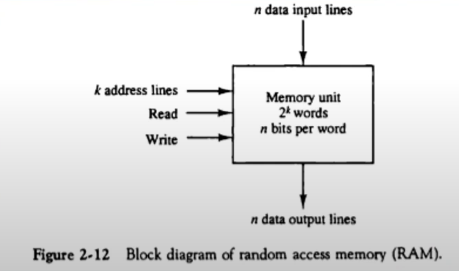
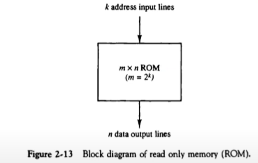

# 2장. 디지털 부품 (Digital Components)

[CSA2021 컴퓨터시스템구조 제 2 장 Part 1]: https://www.youtube.com/watch?v=aj74NlGUAk4&amp;list=PLc8fQ-m7b1hCHTT7VH2oo0Ng7Et096dYc&amp;index=4
[CSA2021 컴퓨터시스템구조 제 2 장 Part 2]: https://www.youtube.com/watch?v=7VPjQMeiHg0&amp;list=PLc8fQ-m7b1hCHTT7VH2oo0Ng7Et096dYc&amp;index=5

## 목차

1. [직접회로 (Integrated Circuits)](#1-직접회로)
2. [디코더 (Decoders)](#2-디코더)
3. [멀티플렉서 (Multiplexers)](#3-멀티플렉서)
4. [레지스터 (Registers)](#4-레지스터)
5. [시프트 레지스터 (Shift Registers)](#5-시프트-레지스터)
6. [이진 카운터 (Binary Counters)](#6-이진-카운터)
7. [메모리 장치 (Memory Unit)](#7-메모리-장치)

## 1. 직접회로

> 보통 IC라고 이야기함. Integrated Circuits

- 정의 
  - 디지털 게이트를 구성하는 전자 부품을 포함하는 실리콘 반도체 칩(Chip)
  - 칩 내부에 게이트들이 연결되고, 외부로도 연결
  - 칩의 등록 번호로 구분(dataBook을 통하여 정보 확인 가능)
  - and, or, not 게이트 뿐만 아니라 디코더, 멀티플렉서 같은 조합회로, 레지스터, 메모리 같은 순차회로 이런 것들을 구성하는 여러가지 소자들, 트랜지스터, 다이오드, 저항, 콘덴서 같은 전자부품들을 포함하는 실리콘 반도체 칩을 이야기. 칩으로 구성된 전자회로 
- 집적 규모에 따른 분류
  - SSI (Small scale Integrated Circuits) - 소규모, 10개 이하의 게이트들로 구성
    - and, or, not 게이트들이 보통 들어있음
    - 간단한 TTL 같은 경우의 SSI가 많음
  - MSI(Middle scale Integrated Circuits) - 중규모, 10~200개의 게이트들로 디코더, 가산기, 레지스터 구현
    - 디코더, 멀티플레서, 가산기, 전가산기, 플립플롭, 레지스터가 들어있으면 MSI라 할 수 있음
  - LSI(Large Integrated Circuits) - 대규모, 200~1,000개의 게이트들로 프로세서나 메모리 칩과 같은 디지털 시스템 형성
    - 일반화된 규모의 IC칩. 보통 1000-2000개 정도의 게이트들로 이루어진 회로.
    - 4비트, 8비트 프로세서, 메모리 단위 칩 등 작은 규모의 시스템을 간단히 만들 때 LSI 정도를 씀
  - VLSI(Very Large Integrated Circuits) - 초대규모, 수천개 이상의 게이트 집적, 대형 메모리나 마이크로컴퓨터 칩 구성
    - 팬텀칩 정도의 마이크로칩을 만들 때 VLSI 규모
  - 구분 예시
    - NE 555 - SSI, MSI 중간 정도
    - TTL - SSI
    - 메인보드 중간의 칩 - LSI(컨트롤러 정도의 기능 수행)
    - Infineon 칩, 칩셋 - VLSI

- 디지털 논리군

  - TTL : Transister-Transistor Logic

    - 일반 로직 회로부품
    - gate delay 늦은 편

  - ECL : Emitter-Coupled Logic

    - 고속 논리 시스템용 부품(1~2ns 이하), 슈퍼컴퓨터용
    - 빠르나 비쌈

  - MOS :  Motel Oxide Semiconductor

    - 고밀도 집적회로용 부품
    - 보통 n형 반도체를 바닥에 깔아 만듦. 전력소모가 많음

  - CMOS :  Complement Metal Oxide Semiconductor

    - 고밀도 회로, 단순한 제조공정, 저전력 특성

    - 바닥에 접지를 깔아 complement형태의 p형 반도체를 깔아 회로를 만들면 항상 반도체에 전력이 들어갈 필요가 없어 전력을 적게 먹음

      

## 2. 디코더

- 컴퓨터에서 사용하는 IC 중 가장 많이 사용하는 조합회로 단연 디코더

- N 비트의 이진 정보를 서로 다른 2^N개의 원소 정보로 출력

  - 2개의 입력 -> 4가지(2^2) 출력 : 2X4 decorder
  - 3개의 입력 -> 8가지(2^3) 출력 : 3X8 decorder

  

  

  - 입력 3개의 디코더 입력에 들어갈 수 있는 경우의 수는 총 8가지 종류가 있음

- 여러 개의 장치 중 한 개만 켜거나 끄는 작업에 사용

- NAND 게이트로 이루어진 디코더

  

  - 보수화된 출력이 더 경제적임
    - CMOS가 기본적으로 complement 로직이기에 1인 신호가 전력을 사용하지 않게 되고 0인 신호가 전력을 사용하게 됨
    - 0이 많으면 불리함
    - 가급적이면 1을 만들어주는 게 좋기에 AND 게이트보다 NAND 게이트로 만드는 게 좋음
  - 대부분의 출력신호가 1로 유지
  - CMOS 회로의 영향으로 저전력 회로에 유리

- 인코더

  

  - 디코더와 반대 동작 수행
  - 2^N의 입력에 대하여 N 이진 코드 출력
  - 한번에 하나의 입력만이 1의 값을 가질 수 있음

- 주의할 점
  - 입력과 반대로 항상 A2, A1, A0 순서로 씀

## 3. 멀티플렉서

- 정의

  - N개의 선택 입력에 따라서 2^N개의 출력을 하나의 출력에 선택적으로 연결

  - 다중 입력 중 하나를 선택하여 출력으로 연결

  - 네트워크 스위치(전화, LAN, WAN)의 기본 구조 요소

    

  - 4개의 입력 -> 2개의 Selector
    - 4-to-1
    - 4x1 MUX
  - 8개의 입력 -> 3개의 Selector

  

  
  - A0~A3, B1~B3 중 어떤 4개 비트 그룹을 보내느냐. 어떤 그룹을 보낼 것이냐 (2-5)
  - 여러 개의 입력 중 하나를 골라서 특정 IP로 보내주는 것. -> 이 기능을 하는 스위치가 멀티플렉서

## 4. 레지스터

- N비트의 데이터를 저장하는 기능을 가지는 반도체 소자로 구성된 단위 논리 집단

- 레지스터의 구성

  - N비트 레지스터 : N비트의 이진 정보 저장
  - N개의 플립플롭과 조합 회로로 구성

- 기본 레지스터

  - 클럭펄스 타이밍에 입력값이 레지스터에 저장
  - 레지스터에 저장된 값은 항상 출력에서 참조 가능
  - Clear, Clock 입력 제공

- 병렬로드 가능한 4비트 레지스터

  - 4비트의 데이터를 동시에 입력 가능
  - Load, Clock 입력 제공

  

  - 4개의 입력, 4개의 출력, 플립플롭도 4개
  - 위에서부터 순서대로 순서대로 A0플립플롭(출력이 A0), A1플립플롭, A2플립플롭, A3플립플롭
  - A0부터 A3까지 4개의 출력을 가지는 4비트 레지스터
  - 8비트가 저장되야 된다하면 4비트 2개 쓰면 됨
  - I0, I1, I2, I3에 입력이 있을 때 클럭펄스가 들어가면 바로 I0, I1, I2, I3에 들어있는 값들이 D플립플롭의 출력에 반응하게 됨 원하든 안원하든 간에.

  

  

  - 병렬 로드가 가능한 4비트 레지스터.
  - I0, I1, I2, I3 어떤값이 대기하고 있고 클럭펄스가 들어갔을 때 로드라는 입력이 1이 되지 않으면 AND 게이트때문에 값이 D플립플롭으로 들어가지 못함
  - 로드입력이 1일 때만 저장이 가능

## 5. 시프트 레지스터

- 정의
  - 레지스터에 저장된 이진 정보를 클럭펄스가 들어왔을 때 한 비트씩 단방향/양방향으로 이동 가능한 레지스터
  - 각 FF들의 입력이 출력과 cascade로 연결
  - 공통의 clock이 다음 상태로의 이동 제어
- 병렬로드를 가지는 양방향 시프트 레지스터(General Register)
  - 병렬로드, 왼쪽/오른쪽 시프트, 병렬출력 기능
  - 동기화된 clock에 의하여 동작
  - 범용 레지스터를 지칭 (아무말 없이 레지스터라 하면 범용 레지스터 가리킴)
- 
  - D플립플롭 4개로 구성
  - 한 번 클럭이 들어올 때마다 비트가 옮겨감 -> 쉬프트 라이트가 가능한 레지스터
- 
  - 병렬로 동시에 로드할 수 있는 제어입력을 가지고 있으면서 레지스터에 들어있는 각 플립플롭에 양방향으로 이동가능한 레지스터
  - 멀티플렉서의 신호입력이 4개의 멀티플렉서 D 플리플롭의 입력으로 들어가는 부분에 S0, S1으로 표시
  - S1, S0 값이 1,1일 경우 외부입력 I0, I1, I2, I3가 병렬로 입력이 들어가서 플립플롭에 저장. 레지스터의 값, 상태가 됨
- 
  - 0,0 이면 레지스터 값이 변화X
  - 0,1이면 shift right, 오른쪽으로! shift down
  - 1,0이면 shift left, 아래에서 위쪽으로 한 비트씩 데이터가 이동
  - 1,1이면 Parallel load. 병렬로 입력을 받아 D플립플롭 값으로 저장

## 6. 이진 카운터

- 이진 카운터
  - 정해진 순서대로 상태 변이 수행
    - 상태 : 레지스터 출력값
    - 상태는 클럭이나 외부 입력에 따라 값이 변하게 되는데 외부입력값또는 클럭값이 어떻게 변하느냐에 따라 레지스터에 들어가는 값이 차례대로 증가되기도 하고 감소되기도 함
  - Clock, 또는 외부 입력에 따른 상태 변이
  - 용도
    - 사건의 발생 횟수 카운트
    - 동작 순서 제어 타이밍 신호 발생에 적용
- 병렬입력을 가진 이진 카운터
  - 카운터 초기값 설정 가능
  - 병렬 입력을 통하여 초기값 로드
  - Load, Clear, Increment 기능

- 
  - 클럭 위 화살표 : 클럭 펄스가 상승 모서리 일 때 클럭이 동작이 되고 그 때 개수가 됨
  - Increment 입력이 들어왔다.카운트입력이 들어왔다.  -> 클럭펄스가 들어오게 되면 Increment 입력이 반영
  - 클럭 아래 화살표 : 하강 모서리에서 동작하는 이진 카운터.
  - Clear값이 1이 되면 모든 값이 Clear가 될 것이고 output은 0이 됨
  - Load입력이 1이면 Input I0, I1, I2, I3값이 Q값으로 들어오게 됨
  - Increment 값만 1이면 A0, A1, A2, A3 상태값(binary 이진값)이 하나 증가
- 
- 
  - 병렬 로드 I0, I1, I2, I3 4개의 입력을 가지고 있는데 4개의 입력값을 미리 정한 다음 그 값을 카운터에 저장해주는 카운터를 병렬입력을 가진 이진 카운터라 함
  - 병렬 로드 입력이 1이 되면 이 값들이 JK 플립플롭 값으로 들어가서 입력값에 해당하는 상태값Q로 플립플롭에 저장. 여기서 Q값은 상태값이고 상태값이 출력값이기에 A0, A1, A2, A3 출력값이 직전에 로드했던 I0, I1, I2, I3값이 될 수 있고 그때부터 클럭이 한 번 들어올 때마다 또는 Increment 신호가 들어올 때마다 카운터가 하나씩 증가 

## 7. 메모리 장치

- 정의

  - 정보의 입출력 기능을 가지는 저장 요소들의 집합
  - Word 단위로 정보를 저장
  - Word : 입출력에서 하나의 단위로 취급되는 비트의 그룹
    - 16bit 컴퓨터 : 레지스터/메모리 버스의 크기가 16bit (2byte)
    - 64bit 컴퓨터 : 레지스터/메모리 버스의 크기가 64bit (4byte)
  - Byte : 워드의 기본 단위
  - MB(10^6 byte), GB(10^9 byte), PB(10^12 byte)

- RAM(Random Access Memory)

  - Word의 물리적인 위치에 관계 없이 데이터 접근
  - 모든 데이터 위치에 대하여 동일한 접근 시간
  -  N 비트의 입력/출력 (word 크기와 동일)
  - K개의 주소 라인으로 2^k개 word 중 하나를 선택
  - 읽기/쓰기 지정(R/W) 
  - 

  

- ROM(Read Only Memory)

  - 한 번 저장된 데이트를 읽기만 가능
  - 1word가 N비트이고 M워드를 저장하는 NxM ROM
  - ROM에 저장된 M wornd를 접근할 수 있는 K개의 주소입력 (2^K = M)
  - 

- ROM의 종류

  - Mask ROM : 석판화(Lithography) 방식으로 구워져 나오는 ROM 
  - PROM : 한번만 프로그램 가능
  - EPROM : UV에 의한 데이터 삭제(ROM 초기화) 및 재프로그래밍 가능
  - EEPROM : 전기 신호에 의한 데이터 삭제/초기화 및 재프로그래밍

- ROM의 기능을 하는 RAM

  - Flash-RAM : BIOS, USB memory, SD card
  - NV-RAM
    - Non-Volatile RAM
    - Battery Backup RAM
