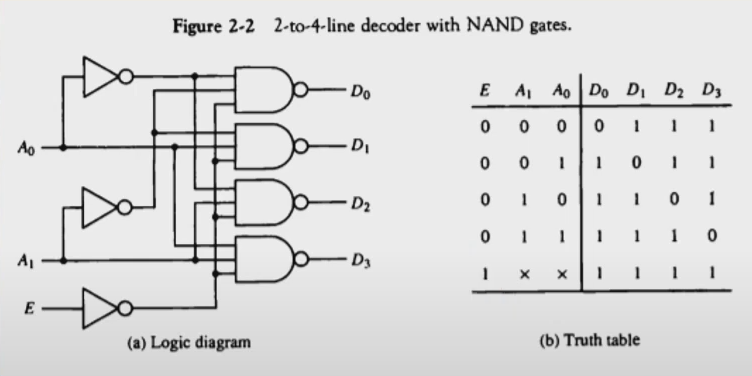

# 2장. 디지털 부품 (Digital Components)

[CSA2021 컴퓨터시스템구조 제 2 장 Part 1]: https://www.youtube.com/watch?v=aj74NlGUAk4&amp;list=PLc8fQ-m7b1hCHTT7VH2oo0Ng7Et096dYc&amp;index=4
[CSA2021 컴퓨터시스템구조 제 2 장 Part 2]: https://www.youtube.com/watch?v=7VPjQMeiHg0&amp;list=PLc8fQ-m7b1hCHTT7VH2oo0Ng7Et096dYc&amp;index=5

## 목차

1. [직접회로 (Integrated Circuits)](#1-직접회로)
2. [디코더 (Decoders)](#2-디코더)
3. [멀티플렉서 (Multiplexers)](#3-멀티플렉서)
4. [레지스터 (Registers)](#4-레지스터)
5. [시프트 레지스터 (Shift Registers)](#5-시프트-레지스터)
6. [이진 카운터 (Binary Counters)](#6-이진-카운터)
7. [메모리 장치 (Memory Unit)](#7-메모리-장치)

## 1. 직접회로

> 보통 IC라고 이야기함. Integrated Circuits

- 정의 
  - 디지털 게이트를 구성하는 전자 부품을 포함하는 실리콘 반도체 칩(Chip)
  - 칩 내부에 게이트들이 연결되고, 외부로도 연결
  - 칩의 등록 번호로 구분(dataBook을 통하여 정보 확인 가능)
  - and, or, not 게이트 뿐만 아니라 디코더, 멀티플렉서 같은 조합회로, 레지스터, 메모리 같은 순차회로 이런 것들을 구성하는 여러가지 소자들, 트랜지스터, 다이오드, 저항, 콘덴서 같은 전자부품들을 포함하는 실리콘 반도체 칩을 이야기. 칩으로 구성된 전자회로 
- 집적 규모에 따른 분류
  - SSI (Small scale Integrated Circuits) - 소규모, 10개 이하의 게이트들로 구성
    - and, or, not 게이트들이 보통 들어있음
    - 간단한 TTL 같은 경우의 SSI가 많음
  - MSI(Middle scale Integrated Circuits) - 중규모, 10~200개의 게이트들로 디코더, 가산기, 레지스터 구현
    - 디코더, 멀티플레서, 가산기, 전가산기, 플립플롭, 레지스터가 들어있으면 MSI라 할 수 있음
  - LSI(Large Integrated Circuits) - 대규모, 200~1,000개의 게이트들로 프로세서나 메모리 칩과 같은 디지털 시스템 형성
    - 일반화된 규모의 IC칩. 보통 1000-2000개 정도의 게이트들로 이루어진 회로.
    - 4비트, 8비트 프로세서, 메모리 단위 칩 등 작은 규모의 시스템을 간단히 만들 때 LSI 정도를 씀
  - VLSI(Very Large Integrated Circuits) - 초대규모, 수천개 이상의 게이트 집적, 대형 메모리나 마이크로컴퓨터 칩 구성
    - 팬텀칩 정도의 마이크로칩을 만들 때 VLSI 규모
  - 구분 예시
    - NE 555 - SSI, MSI 중간 정도
    - TTL - SSI
    - 메인보드 중간의 칩 - LSI(컨트롤러 정도의 기능 수행)
    - Infineon 칩, 칩셋 - VLSI

- 디지털 논리군

  - TTL : Transister-Transistor Logic

    - 일반 로직 회로부품
    - gate delay 늦은 편

  - ECL : Emitter-Coupled Logic

    - 고속 논리 시스템용 부품(1~2ns 이하), 슈퍼컴퓨터용
    - 빠르나 비쌈

  - MOS :  Motel Oxide Semiconductor

    - 고밀도 집적회로용 부품
    - 보통 n형 반도체를 바닥에 깔아 만듦. 전력소모가 많음

  - CMOS :  Complement Metal Oxide Semiconductor

    - 고밀도 회로, 단순한 제조공정, 저전력 특성

    - 바닥에 접지를 깔아 complement형태의 p형 반도체를 깔아 회로를 만들면 항상 반도체에 전력이 들어갈 필요가 없어 전력을 적게 먹음

      

## 2. 디코더

- 컴퓨터에서 사용하는 IC 중 가장 많이 사용하는 조합회로 단연 디코더

- N 비트의 이진 정보를 서로 다른 2^N개의 원소 정보로 출력

  - 2개의 입력 -> 4가지(2^2) 출력 : 2X4 decorder
  - 3개의 입력 -> 8가지(2^3) 출력 : 3X8 decorder

  

  

  - 입력 3개의 디코더 입력에 들어갈 수 있는 경우의 수는 총 8가지 종류가 있음

- 여러 개의 장치 중 한 개만 켜거나 끄는 작업에 사용

- NAND 게이트로 이루어진 디코더

  

  - 보수화된 출력이 더 경제적임
    - CMOS가 기본적으로 complement 로직이기에 1인 신호가 전력을 사용하지 않게 되고 0인 신호가 전력을 사용하게 됨
    - 0이 많으면 불리함
    - 가급적이면 1을 만들어주는 게 좋기에 AND 게이트보다 NAND 게이트로 만드는 게 좋음
  - 대부분의 출력신호가 1로 유지
  - CMOS 회로의 영향으로 저전력 회로에 유리

- 인코더

  

  - 디코더와 반대 동작 수행
  - 2^N의 입력에 대하여 N 이진 코드 출력
  - 한번에 하나의 입력만이 1의 값을 가질 수 있음

- 주의할 점
  - 입력과 반대로 항상 A2, A1, A0 순서로 씀

## 3. 멀티플렉서

## 4. 레지스터

## 5. 시프트 레지스터

## 6. 이진 카운터

## 7. 메모리 장치

