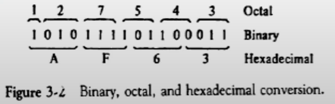
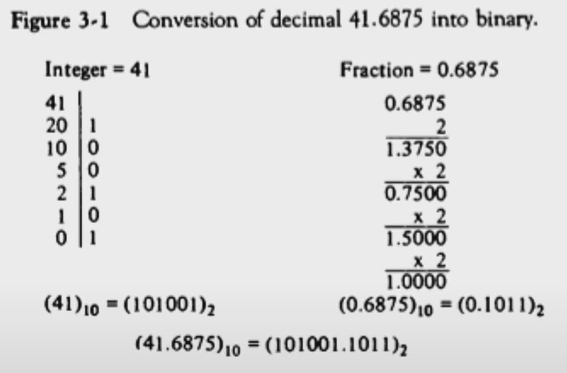
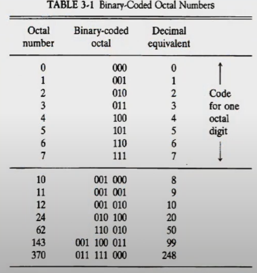
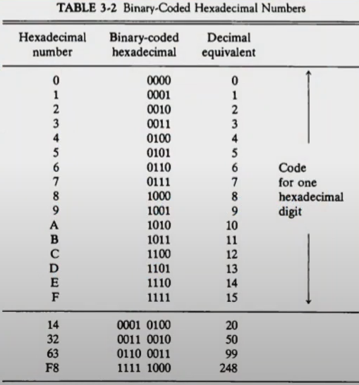
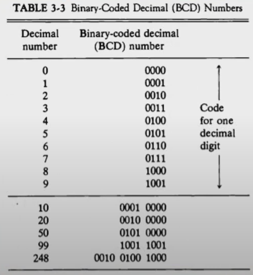

# 3장. 데이터의 표현

[CSA2021 컴퓨터시스템구조 제 3 장 Part 1]: https://www.youtube.com/watch?v=aSocCv3SC2k&amp;list=PLc8fQ-m7b1hCHTT7VH2oo0Ng7Et096dYc&amp;index=6
[CSA2021 컴퓨터시스템구조 제 3 장 Part 2]: https://www.youtube.com/watch?v=bysGzutpRgc&amp;list=PLc8fQ-m7b1hCHTT7VH2oo0Ng7Et096dYc&amp;index=7


## 목차

1. [데이터의 종류 (Data Types)](#1-데이터의-종류)
2. [보수 (Complements)](#2-보수)
3. [고정 소수점 표현 (Fixed Point Representation)](#3-고정-소수점-표현)
4. [부동 소수점 표현 (Floating Point Representation)](#4-부동-소수점-표현)
5. [기타 이진 코드 (Other Binary Codes)](#5-기타-이진-코드)
6. [에러 검출 코드 (Error Detection Codes)](#6-에러-검출-코드)


## 1. 데이터의 종류

- 컴퓨터 레지스터에서 쓰이는 데이터의 종류
  - 산술 연산용 숫자(Numeric)
  - 데이터 처리용 영문자(Alpha)
  - 특수 목적용 기호(Special)
- 진수와 진법
  - radix : 진법의 기수에 해당(10, 2, 8, 16 ...)
  - 
  - 10진수
    - ```724.5 = 7*10^2 + 2*10^1 + 4*10^0 + 5*10^(-1)```
  - 2진수
    - ```101101 = 1*2^5 + 0*2^4 + 1*2^3 + 1*2^2 + 0*2^1 + 1*2^0 = 45```
    - 
  - 8진수
    - ```736.4 = 7*8^2 + 3*8^1 + 6*8^0 + 4*8^(-1) = 478.5```
  - 16진수
    - ```F3 = F*16^1 + 3*16^0 = 243```

- 2진화 8진수(Octal)
  - 
- 2진화 16진수(Hexadecimal)
  - 
- 2진화 10진수(BCD : Binary Code Decimal)
  - 

- 영숫자(AlphaNumeric)의 표시
  - ASCⅡ Code : 7bits (+1 parity bit)
    - 
  - EBCDIC Code : 16bits, IBM internal code
  - UniCode : 16bits/32bits


## 2. 보수


## 3. 고정 소수점 표현


## 4. 부동 소수점 표현


## 5. 기타 이진 코드


## 6. 에러 검출 코드
