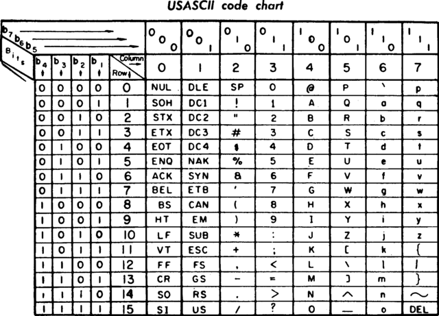

# 3장. 데이터의 표현

[CSA2021 컴퓨터시스템구조 제 3 장 Part 1]: https://www.youtube.com/watch?v=aSocCv3SC2k&amp;list=PLc8fQ-m7b1hCHTT7VH2oo0Ng7Et096dYc&amp;index=6
[CSA2021 컴퓨터시스템구조 제 3 장 Part 2]: https://www.youtube.com/watch?v=bysGzutpRgc&amp;list=PLc8fQ-m7b1hCHTT7VH2oo0Ng7Et096dYc&amp;index=7


## 목차

1. [데이터의 종류 (Data Types)](#1-데이터의-종류)
2. [보수 (Complements)](#2-보수)
3. [고정 소수점 표현 (Fixed Point Representation)](#3-고정-소수점-표현)
4. [부동 소수점 표현 (Floating Point Representation)](#4-부동-소수점-표현)
5. [기타 이진 코드 (Other Binary Codes)](#5-기타-이진-코드)
6. [에러 검출 코드 (Error Detection Codes)](#6-에러-검출-코드)


## 1. 데이터의 종류

- 컴퓨터 레지스터에서 쓰이는 데이터의 종류
  - 산술 연산용 숫자(Numeric)
  - 데이터 처리용 영문자(Alpha)
  - 특수 목적용 기호(Special)
- 진수와 진법
  - radix : 진법의 기수에 해당(10, 2, 8, 16 ...)
  - 
  - 10진수
    - ```724.5 = 7*10^2 + 2*10^1 + 4*10^0 + 5*10^(-1)```
  - 2진수
    - ```101101 = 1*2^5 + 0*2^4 + 1*2^3 + 1*2^2 + 0*2^1 + 1*2^0 = 45```
    - 
  - 8진수
    - ```736.4 = 7*8^2 + 3*8^1 + 6*8^0 + 4*8^(-1) = 478.5```
  - 16진수
    - ```F3 = F*16^1 + 3*16^0 = 243```
- 2진화 8진수(Octal)
  - 
- 2진화 16진수(Hexadecimal)
  - 
- 2진화 10진수(BCD : Binary Code Decimal)
  - 
- 영숫자(AlphaNumeric)의 표시
  - ASCⅡ Code : 7bits (+1 parity bit)
    - 'A' : 100 0001
    - 
  - EBCDIC Code : 16bits, IBM internal code
  - UniCode : 16bits/32bits
    - 'A' : 01000001
- Special Communication Data
  - Morse Code
    - 
  - Flag Signal (Red/White flags)
    - 


## 2. 보수

- 정의
  - 진법의 기수 r에 대응하는 역(reverse) 값
  - 뺄셈과 논리 계산에 사용
- (r-1)의 보수 체계
  - 9's complement 99999 - 12389 = 87610
  - 1's complement 1111111 - 0001111 = 1110000
- (r)의 보수 체계
  - 10's complemnet 100000 - 12389 = 87611
  - 2's complement 10000000 - 0001111 = 1110001 
- 부호 없는 숫자의 뺄셈
  - 72532 - 13250 = 59282
    - 
  - 13250 - 72532 = -40728
    - 
  - 부호없는 2진수의 뺄셈
    - 


## 3. 고정 소수점 표현

- 정의
  - 소수점의 위치를 결정하여 숫자 표현
  - 레지스터 비트에 소수점 위치를 표시
    - 
  - 16bit 정수의 경우 최우측(LSB)에 소수점 자리 위치
  - 부동소수점의 경우, 레지스터 비트 앞/중간에 소수점 자리 위치
- 정수의 표현(-14)
  - MSB(Most Significant Bit)로 부호 표현
  - 양수는 MSB -> 0, 음수는 MSB -> 1
  - 부호 절대값 표현(Signed magnitude)                1 0001110
  - 부호화된 1의 보수(signed 1's complement)     1 1110001
  - 부호화된 2의 보수(signed 2's complement)     1 1110010
    - 대부분의 컴퓨터, CPU에서 사용(Intel, AMD, Zilog...)
- 산술 가산(Arithmetic add)
  - 
- 산술 감산(Arithmetic substract)
  - 

- 오버플로우(Overflow)의 발생
  - N자리의 두 수를 더하여 N+1자리의 합이 발생하였을 때.
  - 가수, 피가수의 부호와 관계없이 발생
  - 정해진 레지스터의 비트수로 인한 문제
    - 종이와 연필로 연산할 경우 절대 발생되지 않을 상황
    - 정해진 비트수 내에서만 연사이 간으한 컴퓨터에서 발생
- 오버플로우 발생 상황
  - 연산 결과값이 레지스터의 비트수를 초과할 경우 발생
  - 두 수의 부호가 같을 경우에만 발생
  - 레지스터에 저장된 연산 결과값은 잘못된 값으로 저장
  - 
- 오버플로우 처리 방법
  - 오버플로우 발생을 미리 확인
    - MSB의 두 캐리 비트의 값이 서로 다르면 오버플로우
    - if C₈ ⊕ C₇ = 1, Overflow occurs
  - 연산을 처리하지 않고 인터럽트 또는 에러 처리


## 4. 부동 소수점 표현

- 부동 소수점 표시방법(IEEE 754)

  - 가수와 지수로 표현

  - 가수(mantissa) : 분수(Fraction), 정수값 표시

  - 지수(Component) : 십진/이진 소수점 위치를 표시

  - 

    - 첫 번째는 부호 비트

    - 두 번째는 8bit의 지수 component 부분 표현

      - 많은 컴퓨터들이 지수를 표현할 때 128을 기준으로 사용

      - 양수와 음수의 정가운데 0을 음수로 표현할 수 없기에 128을 0으로 표시

        ex. 126 = -2, 130 = 2

      - -127~127 승까지 component로 표시 가능

      - 128 + 4 = 132 => 10000100

    - 마지막 23bit가 fraction mantissa 부분 표현

      - 소수점 다음 자리인 가장 좌측 1 제외 001110
      - 그 이유는 fraction을 최대 24bit까지 표현할 수 있기에
      - 어차피 소수점 다음자리는 1이 나올 수 밖에 없기에
      - 정밀도 높아짐 

- 정규화(Nomalization)

  - 부동소수점 숫자에서 최상위 비트가 0이 아닌 경우
  - 0이 있을 경우, Mantissa의 소수점 위치 이동
  - 이동한 만큼 exponent의 값 변경
  - 


## 5. 기타 이진 코드

- Gray Code
  - 한 숫자에서 다음 숫자로 변할 때 한 비트만 변동
  - 제어 계통에 주로 사용
  - 여러 전기 신호가 동시에 바뀔 때 낮은 에러 발생률
  - 
- BCD Code
  - 10진수에 대한 2진수 표현(i.e. 8421 code)
  - 4bit를 사용 0~9까지 사용(0000~1001)
- Excess-3 Code
  - BCD Code + 0011
  - 암호  교신의 기본 코드, 파생 암호 발생 방법에 사용
- 기타 영문 code
  - ASCⅡ : 7bits + parity 1bit
  - EBCDIC : 8bits + parity 1bit
- Decimal, BCD, Excess-3 code 비교
  - 


## 6. 에러 검출 코드
