# 4장. 레지스터 전송과 마이크로 연산

[CSA2021 컴퓨터시스템구조 제 4 장 Part 1]: https://www.youtube.com/watch?v=LDjco5XJH1E&amp;list=PLc8fQ-m7b1hCHTT7VH2oo0Ng7Et096dYc&amp;index=8
[CSA2021 컴퓨터시스템구조 제 4 장 Part 2]: https://www.youtube.com/watch?v=IUapFpDKhKI&amp;list=PLc8fQ-m7b1hCHTT7VH2oo0Ng7Et096dYc&amp;index=9

- 레지스터 전송 : CPU 안에 있는 레지스터의 데이터를 또 다른 레지스터로 옮기는 것. 
  - Resister to Resister.
- Bus와 Memory 사이 전송
  - Bus : 데이터가 지나가는 라인의 집단. 
    - 데이터를 8bit, 16bit, 32bit단위로 전송한다 할 때 데이터들이 한꺼번에 병렬로 도선을 통해서 신호가 나가는데 그 도선을 뜻함
    - 버스를 이용해서 레지스터에 있는 데이터를 한꺼번에 메모리로 전송하거나 메모리로부터 받아옴
- CPU 3대 구성요소
  - 연산장치 : ALU(산술 논리 시프트 장치)
  - 제어장치
  - 기억장치

## 목차

1. [레지스터 전송 언어 (Resister Transfer Language)](#1-레지스터-전송-언어)
2. [레지스터 전송 (Register Transfer)](#2-레지스터-전송)
3. [버스와 메모리 전송 (Bus and Memory Transfers)](#3-버스와-메모리-전송)
4. [산술 마이크로 연산 (Arithmetic Microoperations)](#4-산술-마이크로-연산)
5. [논리 마이크로 연산 (Logic Microoperations)](#5-논리-마이크로-연산)
6. [시프트 마이크로 연산 (Shift Microoperations)](#6-시프트-마이크로-연산)
7. [산술 논리 시프트 장치 (Arithmetic-Logic Shift Unit)](#7-산술-논리-시프트-장치)

### 1. 레지스터 전송 언어

- 마이크로연산(Micro-operation)
  - 레지스터에 저장된 데이터를 가지고 실행되는 동작
  - 하나의 clock 시간 동안 실행되는 기본 동작(Shft, coumt, clear, load...)
- 레지스터전송언어
  - 마이크로연산, 전송을 간단하고 명료하게 표시하기 위하여 사용하는 기호
  - 디지털 컴퓨터의 내부 조직을 상세하게 나타내는 수단으로 사용
  - 디지털 시스템의 설계 편의성 제공
- 레지스터 전송 언어 규칙
  - 대문자로 표시(MAR, MBR, AC, PC, DR ...)
    - Memory Address Register
    - Memory Buffer Register
    - Accumulator
    - Program Counter
    - Data Register
  - 레지스터 가장 왼쪽 FF(플립플롭) -> MSB(Master Significant Bit) 가장 오른쪽 -> LSB(Least Significant Bit)
    - 레지스터는 여러 개의 플립플롭이 붙어 만들어진 것
    - 가장 왼쪽에 있는 플립플롭, 그 플립플롭이 전하고 있는 bit 값 : MSB 
    - 가장 오른쪽에 플립플롭에 전환된 데이터 : LSB
  - 16비트 PC 레지스터의 경우,
    - 상위(8~15) : PC(H)
    - 하위(0~7) : PC(L)
- 

### 2. 레지스터 전송

- 레지스터 정보 전송

  - 치환(replacement) 연산자 사용

    - R2 <- R1

  - 제어 조건이 있을 경우,

    - If (P=1) then (R2 <- R1)

    

  - 제어 함수로 표현할 경우,

    - P:R2 <- R1
    - P? R2=0:R1=0
    - R2에는 t+1 타이밍에 전송 완료

- 레지스터 전송의 기본 기호

  - Register data exchange
    - T:R2<-R1, R1<-R2
  - 

### 3. 버스와 메모리 전송

- 공통 버스(Common Bus)
  - 레지스터들 사이의 전송 통로
  - 한 번에 하나의 신호만 전송하도록 제어
  - 멀티플렉서를 사용하여 레지스터 선택
  - (레지스터 전송문으로 표현 예)
    - BUS <- C, R1 <- BUS
    - :EQ           R1 <- C
- 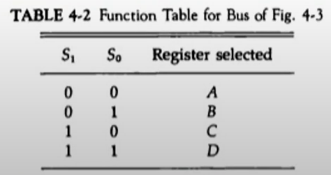
- 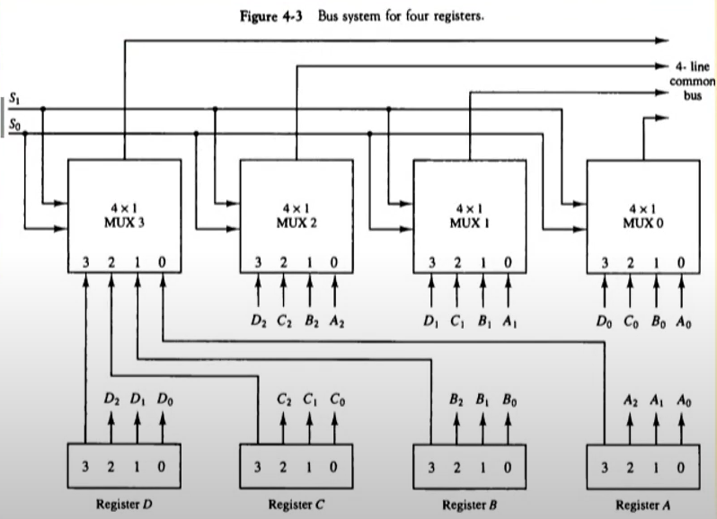

- 3-상태 버퍼(3-state Buffer)
  - 멀티플렉서 대신 사용하여 버스 구성 가능
  - 3개의 상태로 종작
    - 논리 0, 논리 1 : 정상적인 버퍼로 동작
    - 고저항 상태(High-impedance) : 출력 차단
    - 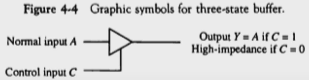
    - 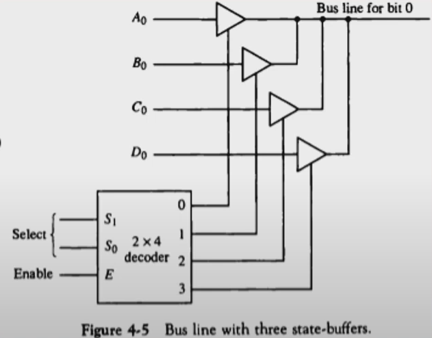
- 메모리 전송
  - Read : DR <- M[AR]
  - Write : M[AR] <- R1

### 4. 산술 마이크로 연산

- 마이크로 연산의 분류
  - 레지스터 전송 마이크로 연산 : 레지스터간 이진 정보 전송
  - 산술 마이크로 연산 : 수치 데이터에 대한 산술 연산
  - 논리 마이크로 연산 : 비수치 데이터에 대한 비트 조작 연산
  - 시프트 마이크로 연산 : 데이터에 대한 시프트 연산
- 산술 마이크로 연산
  - 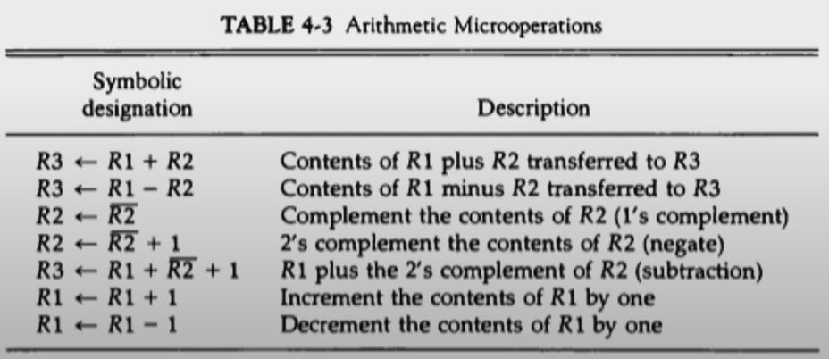

- 이진 가산기
  - 두 비트와 이진 캐리의 산술합을 계산
  - 여러 개의 전가산기를 연결
  - 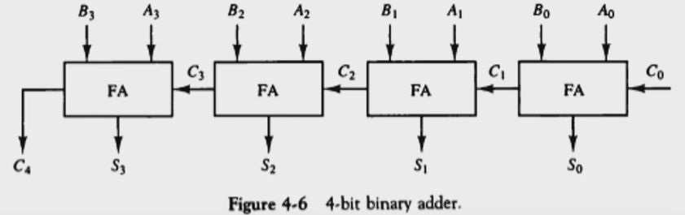
- 이진 감가산기
  - 보수를 만드는 게이트와 신호 사용
    - M -> 0 : 가산
    - M -> 1 : 감산
  - A(0-3), B(0-3), S(0-3)는 bus에 연결
  - 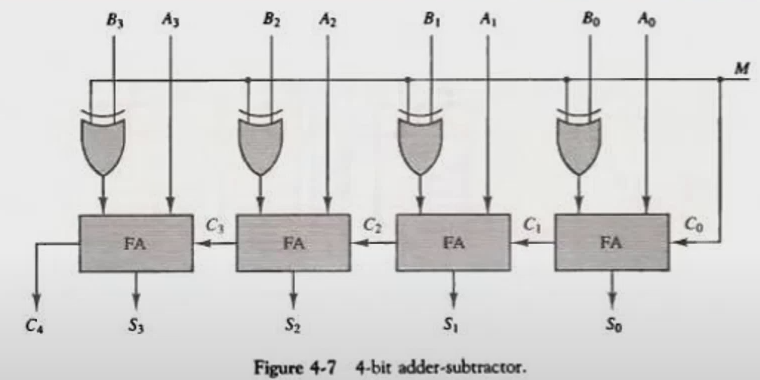

- 산술 회로
  - 4개의 전가산기
  - 4개의 멀티플렉서
  - 2개의 4비트 입력(A,B)
  - 1개의 출력(D)
  - 3개의 제어 라인(S₁,S₀,Cᵢₙ)
  - 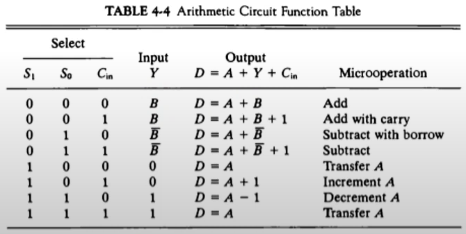
  - 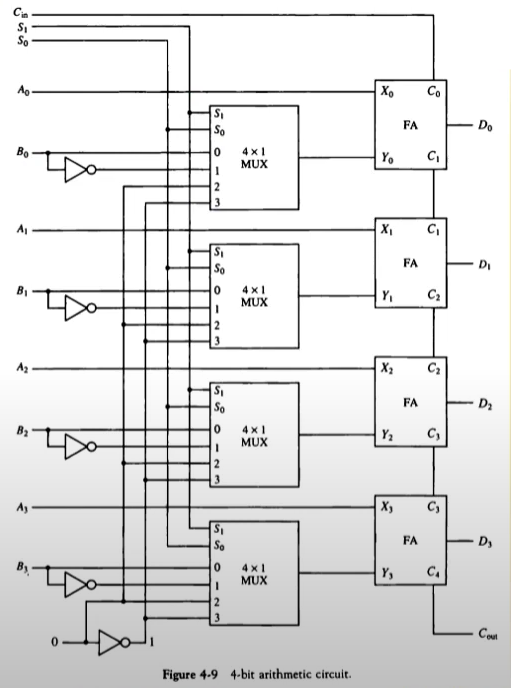

### 5. 논리 마이크로 연산

- 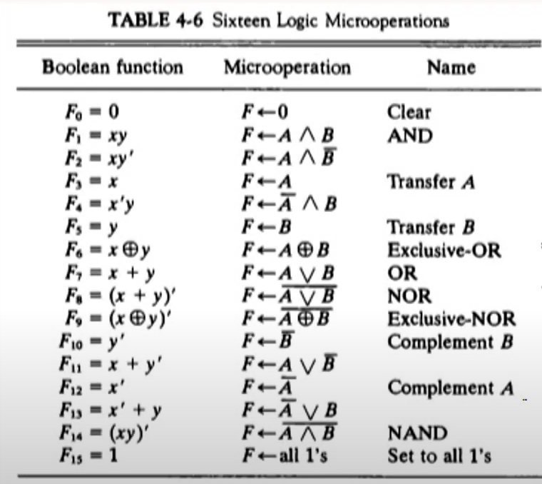
- 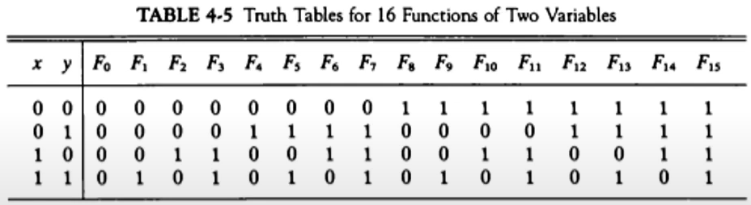

- 논리 마이크로연산의 하드웨어 구현
  - 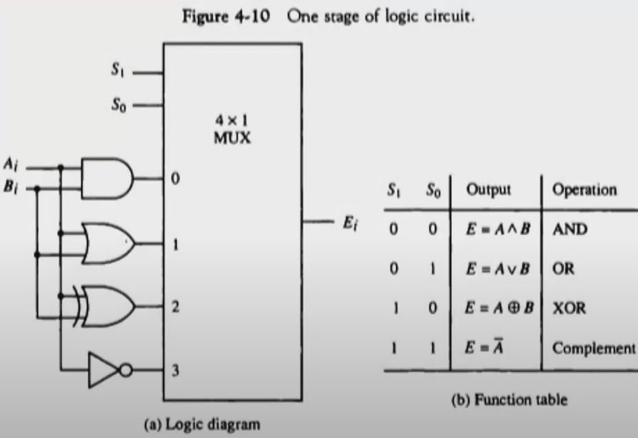

### 6. 시프트 마이크로 연산

- 논리 시프트
  - 직렬 입력으로 0이 전송
    - R1 <-shl(R1)
    - R2 <- shr(R2)

- 순환 리프트
  - 직렬 출력이 직렬 입력으로 전송
  - cir, cil
- 산술 리프트
  - 부호 비트를 제외하고 시프트
  - 왼쪽 시프트 : x2
  - 오른쪽 시프트 : /2
    - 

- 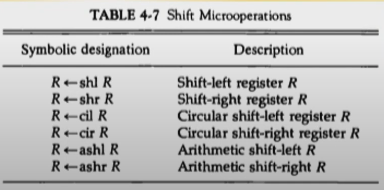

### 7. 산술 논리 시프트 장치