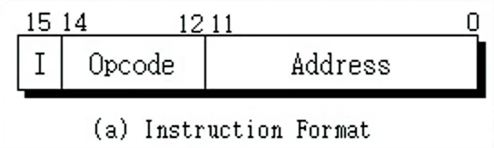
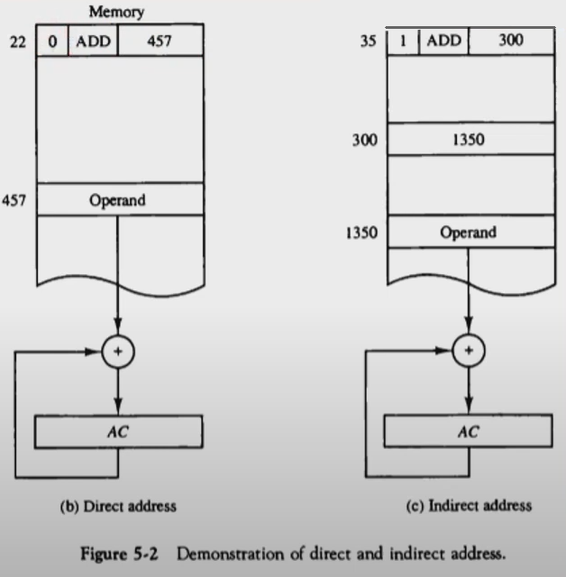
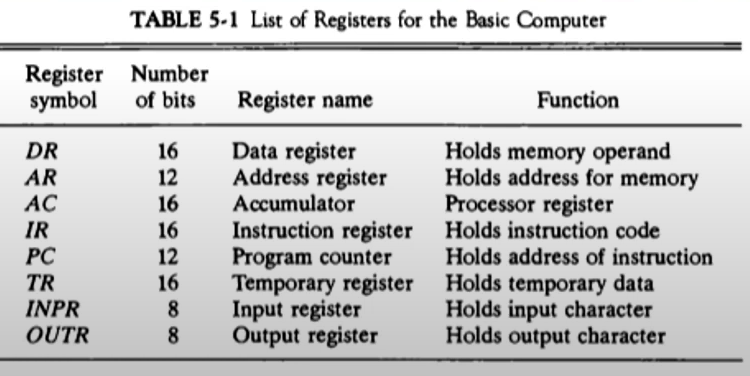
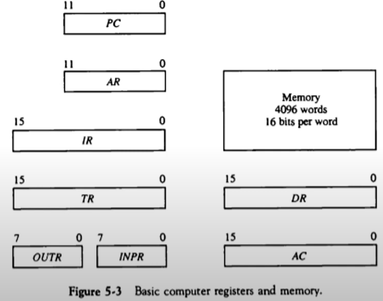
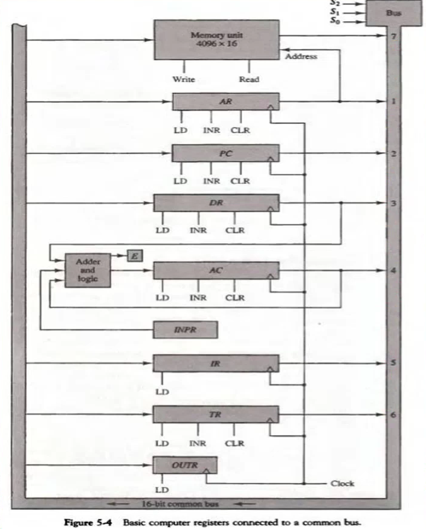
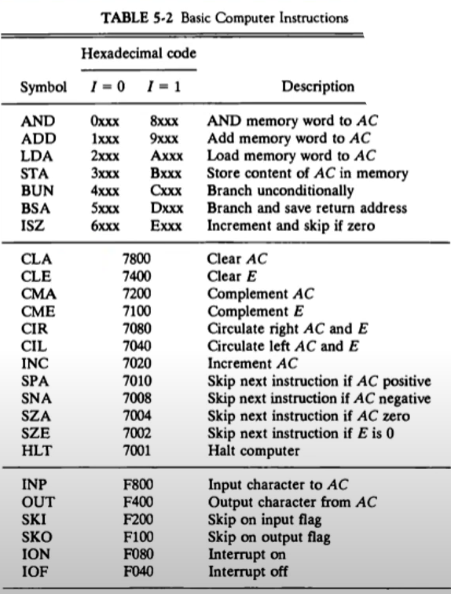
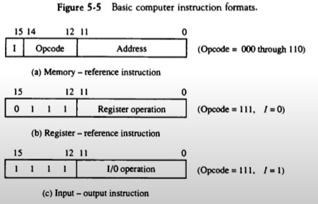
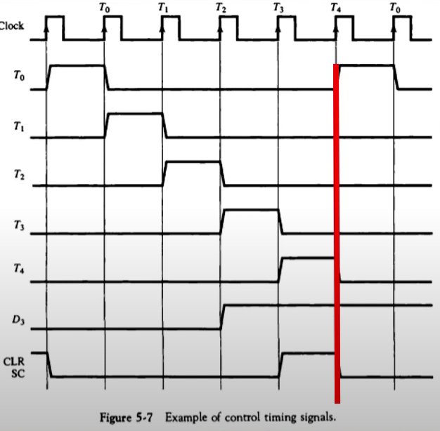
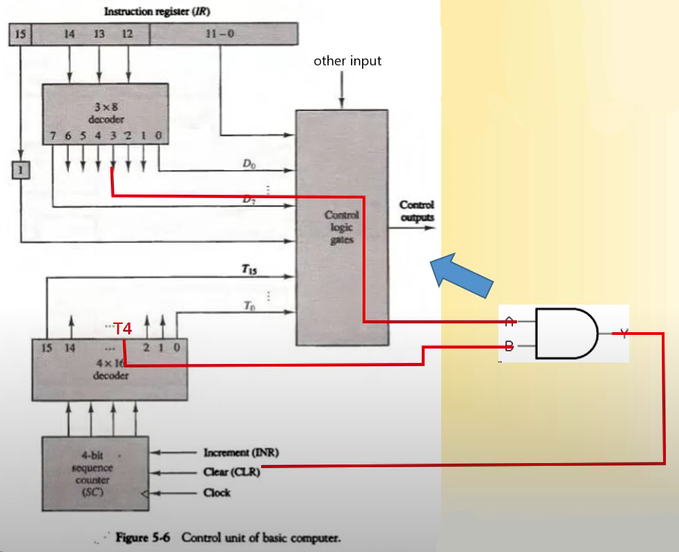

# 5장. 기본 컴퓨터의 구조와 설계 Part1

[CSA2021 컴퓨터시스템구조 제 5 장 Part 1-1]: https://www.youtube.com/watch?v=vSnpYzCuwVY&amp;list=PLc8fQ-m7b1hCHTT7VH2oo0Ng7Et096dYc&amp;index=10
[CSA2021 컴퓨터시스템구조 제 5 장 Part 1-2]: https://www.youtube.com/watch?v=T2oKxvinK84&amp;list=PLc8fQ-m7b1hCHTT7VH2oo0Ng7Et096dYc&amp;index=11

## 목차

- [기본 컴퓨터(Basic Computer)](#기본-컴퓨터)

1. [명령어 코드(Instruction Codes)](#1-명령어-코드)
2. [컴퓨터 레지스터(Computer Registers))](#2-컴퓨터-레지스터)
3. [컴퓨터 명령어(Computer Instructions)](#3-컴퓨터-명령어)
4. [타이밍과 제어(Timing and Control))](#4-타이밍과-제어)
5. [명령어 사이클(Instruction Cycle)](#5-명령어-사이클)
6. [메모리 참조 명령어(Memory-Reference Instructions)](#6-메모리-참조-명령어)
7. [입출력과 인터럽트(Input-Output and Interrupt)](#7-입출력과-인터럽트)
8. [컴퓨터에 대한 완전한 기술(Complete Computer Description)](#8-컴퓨터에-대한-완전한-기술)
9. [기본 컴퓨터의 설계(Design of Basic Computer)](#9-기본-컴퓨터의-설계)
10. [누산기 논리의 설계(Design of Accumulator Logic)](#10-누산기-논리의-설계)

## 기본 컴퓨터

- DEC. Corp사의 중형 컴퓨터 PDP-11을 지칭
  - 이후 VAX-11 등의 주요 minicomputer의 기본(1970~1980년대)
- 컴퓨터 구조 설계의 가장 기본적인 부분
- 현대의 CPU들에도 동일하게 적용되는 설계 구조

## 1. 명령어 코드

- 컴퓨터의 동작
  - 레지스터 내에 저장된 데이터에 대한 마이크로 연산의 시퀀스에 의하여 정의
  - 범용 컴퓨터 시스템에서는 다양한 마이크로 연산 시퀀스를 정의
- 명령어 코드
  - 컴퓨터에게 어떤 특별한 동작을 수행할 것을 알리는 비트들의 집합
  - 연산 코드들로 구성
- 컴퓨터 명령어
  - 컴퓨터에 대한 일련의 마이크로 연산을 기술
  - 이진 코드로 구성
  - 데이터와 함께 메모리에 저장
- 프로그램
  - 사용자가 원하는 연산과 피연산자가 처리되는 순서를 기술한 컴퓨터 명령어의 집합
  - 명령어 처리 과정을 제어
- 내장 프로그램
  - 제어 신호에 의하여 명령어의 이진 코드를 해석하여 실행
  - 명령어를 저장하여 실행하는 컴퓨터 구동 방식
- 저장(내장) 프로그램 구조
  - 명령어의 집합으로 구성
  - 각 명령어는 명령어 포맷(Instruction format)에 따라서 정의
  - 프로그램 실행부분에 따라서 메모리의 다른 부분(segment)에 저장
  - 명령어 실행 결과는 AC에 저장
  - 
  - 

- 간접주소(Indirect Address) 시스템
  - 많은 경우, 직접주소를 사용하여 데이터 지정
  - 필요한 경우, 간접주소로 데이터 지정
  - 

## 2. 컴퓨터 레지스터

- 기본 컴퓨터의 레지스터
  - 기본 컴퓨터란?
    - DEC PDP-11 Mini Computer
    - 가상의 컴퓨터가 아닌 실제 제품
    - 1980년대 주력 메인프레임급
    - 최신의 CPU도 기본적으로 동일한 구조
  - 기본 컴퓨터 레지스터 종류
    - 

- 

- 버스 시스템의 종류
  - 내부 버스
    - CPU(컴퓨터)내부 레지스터간 연결
  - 외부 버스
    - CPU 내부 레지스터 - 메모리간 연결
  - 입출력 버스
    - CPU ↔ 주변장치(I/O) 연결
  
- 공통 버스 시스템
  - 내부 버스를 통칭
  - 내부 버스의 크기(Width)로 CPU 워드 크기 결정
    - 16bit 컴퓨터 - 내부 버스/레지스터 크기가 16bit
    - 32bit 컴퓨터 - 내부 버스/레지스터 크기가 32bit
  - 전송 연결 통로
    - 레지스터-레지스터 데이터 전송 통로
    - 레지스터-메모리 데이터 전송 통로(예외적 표현)
    - 한 순간에는 하나의 전송 신호만이 버스에 존재 가능
      - 2개 이상의 신호 발생시에는 버스 충돌(Collison) 발생
      - 버스 제어기(정확한 타이밍과 MUX 제어 수행)
  
- 공통 버스 시스템

  - 레지스터 출력은 버스의 MUX 입력에 연결
  - 각 레지스터에 MUX 입력번호 설정됨
  - 레지스터 입력은 버스에 직접 연결(LD로 제어)
  - S₂, S₁, S₀에 의하여 레지스터 출력 결정
  - 
    - MUX Inputs
      - 1 : AR
      - 2 : PC
      - 3 : DR
      - 4 : AC
      - 5 : DR
      - 6 : TR
      - 7 : Memory

- 버스의 동작

  - DR <- AC, AC <- DR
  - M[AR] <- DR
  - AR <- PC

## 3. 컴퓨터 명령어
- 기본 컴퓨터 명령어의 종류
  - MRI 명령 7가지
  - RRI 명령 12가지
  - IO 명령 6가지
  - 
- 명령어 포맷
  - 

## 4. 타이밍과 제어
- 명령어 실행 타이밍 예
  - D₃T₄:SC <- 0
  - 
  - 

## 5. 명령어 사이클

## 6. 메모리 참조 명령어

## 7. 입출력과 인터럽트

## 8. 컴퓨터에 대한 완전한 기술

## 9. 기본 컴퓨터의 설계

## 10. 누산기 논리의 설계

