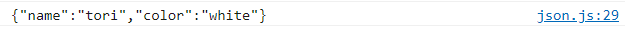

# JSON 개념 정리와 활용방법 및 유용한 사이트 공유 (JavaScript ES6)

[자바스크립트 기초 강의 10]: https://www.youtube.com/watch?v=FN_D4Ihs3LE


## HTTP

- HTTP (Hypertext Transfer Protocal)
  - browser 위에서 동작하고 있는 웹사이트나 웹어플리케이션과 같은 client들이 어떻게 server와 통신할 수 있는 지 정의한 것
  - 어떻게 Hypertext를 서로 주고받을 수 있는지를 규약한 protocal의 하나
  - client가 server에게 데이터를 request할 수 있고 server는 client가 요청한 것에 따라 그에 맞는 response를 client에게 보냄
  - Hypertext - 웹사이트에서 이용되어지고 있는Hyper link들만 이야기하는 것이 아니라 전반적으로 쓰여지고 있는 resource를 문서나 Image file들 등을 다 포함해서 말함
- HTTP를 이용해서 server에게 데이터를 요청해서 받아올 수 있는 방법
  - AJAX
    - Asynchronous JavaScript And XML
    - 웹페이지에서 동적으로 서버에게 데이터를 주고받을 수 았는 기술
    - 대표적인 예 - XHR (XMLHttpRequest)
      - XHR object는 browser API에서 제공하는 object 중 하나로 이 object를 이용하면 간단하게 서버에게 데이터를 요청하고 받아올 수 있음
      - 최근 browser API에 추가된 fetch() API를 이용하면 간편하게 데이터를 주고받을 수 있음
      - fetch는 internet explorer에서 지원이 되지 않기 때문에 이 점을 유의해서 사용해야함


## XML

- XML
  - html과 같은 markup 언어 중 하나
  - 태그들을 이용해서 데이터를 나타냄
- 서버와 데이터를 주고받을 때는 XML만 가능한가?
  - 서버와 데이터를 주고받을 때는 XML뿐만 아니라 다양한 파일 포맷을 전달받을 수 있음
  - JSON을 요즘 많이씀
- XML이라는 이름이 지워진 이유
  - AJAX와 XHR이 활발히 개발되어지고 있을 당시에 microsoft사에 있는 outlook을 만드는 개발팀이 활발히 참여했는데 이때 outlook은 서버와 클라이언트 데이터 전송을 할 때 XML을 사용했음. 그래서 XML을 HttpRequest 앞에 붙여서 개발하게 됨.
- 데이터를 주고 받을 때는 XML 뿐만 아니라 다양한 타입의 데이터를 주고받을 수 있기 때문에 앞에 XML이라고 이름지은 것은  굉장히 큰 실수 -> 함수, class, object 이름을 정할 때 특히 외부로 노출되는 api를 만들 때는 api의 이름을 명료하게 잘지어야한다는 교훈 얻을 수 있음
- 브라우저에서 서버와 통신을 할 때는 새로 추가된 fetch() API, 요즘도 흔하게 쓰여지고 있는 XMLHttpRequest라는 object를 이용할 수도 있음. 
- XML을 사용하면 불필요한 태그들이 너무 많이 들어가서 파일 사이즈도 커질 뿐만 아니라 가독성도 좋지 않기 때문에 XML은 많이 사용되고 있지 않음. XML 대신에 요즘에는 JSON을 많이 사용


## JSON (JavaScript Object Notation)

- ECMAScript 3rd 1999 object에서 큰 영감을 받아 쓰여진 데이터 포맷
- 자바스크립트에서 object를 보면 {key:value}로 이루어져 있는데 JSON도 똑같음
- JSON은 브라우저 뿐만 아니라 모바일에서 서버와 데이터를 주고받을 때 또는 서버와 통신을 하지않아도 object를 파일 시스템에 저장할 때도 JSON 데이터타입을 많이 이용함
- JSON
  - simplest data interchange format : 데이터를 주고받을 때 쓸 수 있는 가장 간단한 파일 포맷
  - lightweight text-based structure : 텍스트를 기반으로 가벼움
  - easy to read : 읽기 편함
  - key-value pairs : key와 value로 이루어짐 
  - used for serialization and transmission of data between the network the network connection : 데이터를 보통은 서버와 주고받을 때 serialization(직렬화)을 위해 씀
  - independent programming language and platform : program language나 platform에 상관없이 쓰일 수 있음. C언어, C#, JAVA, Python 등의 언어와 상관없이  이 모든 언어와 이 언어가 쓰여지고 있는 플랫폼에 상관없이 거의 대부분의 언어들이 JSON으로 serialization된 object를 다시 그 언어의 특징에 맞게 object로 변환하고 object를 다시 json으로 serialization 하는 것을 지원해주거나 많이 쓰여지고 있는 외부 라이브러리를 통해서 이런 것들이 가능하게 됨.

- ```
  interface JSON {
      /**
       * Converts a JavaScript Object Notation (JSON) string into an object.
       * @param text A valid JSON string.
       * @param reviver A function that transforms the results. This function is called for each member of the object.
       * If a member contains nested objects, the nested objects are transformed before the parent object is.
       */
      parse(text: string, reviver?: (this: any, key: string, value: any) => any): any;
      /**
       * Converts a JavaScript value to a JavaScript Object Notation (JSON) string.
       * @param value A JavaScript value, usually an object or array, to be converted.
       * @param replacer A function that transforms the results.
       * @param space Adds indentation, white space, and line break characters to the return-value JSON text to make it easier to read.
       */
      stringify(value: any, replacer?: (this: any, key: string, value: any) => any, space?: string | number): string;
      /**
       * Converts a JavaScript value to a JavaScript Object Notation (JSON) string.
       * @param value A JavaScript value, usually an object or array, to be converted.
       * @param replacer An array of strings and numbers that acts as an approved list for selecting the object properties that will be stringified.
       * @param space Adds indentation, white space, and line break characters to the return-value JSON text to make it easier to read.
       */
      stringify(value: any, replacer?: (number | string)[] | null, space?: string | number): string;
  }
  ```

  - JSON이라는 interface 안에는 parse, stringify 총 두가지의 api가 있음 

  - 전해지는 매개변수가 차이가 있는 동일한 이름의 함수가 두 개있음 -> 오버로딩(Overloading)

    - 오버로딩 : 함수의 이름은 동일하지만 어떤 파라미터를 전달하냐 몇 개의 파라미터를 전달하냐에 따라 각각 다른 방식의 호출가능한 것

    - parse

      - JSON에 string data를 넣으면 어떤 타입의 object로도 변환이 됨
      - 전달해도 되고 안해도 되는 optional 타입의 callback함수 reviver이 있는데 결과값을 변형하는 느낌.
      - string을 object로 변환할 때 object가 만들어지는 과정을 조금 더 세밀하게 조정하고 싶다면 바로 reviver 함수를 이용하면 됨.

    - stringify

      - 어떤 타입의 object를 받아와서 바로 string으로 변환
      - string으로 만들 때 좀 더 세밀하게 통제하고 싶다면 callback함수를 전달하면 우리가 좀 더 통제하면서 string으로 만들 수 있음

      

## JSON 공부 포인트

1. object를 어떻게 serialize 즉, 직렬화해서 JSON으로 변환할 지
2. 직렬화된 JSON을 어떻게 deserialize해서 object로 다시 변환할 지 


## stringify(obj)

- ```
  // 1. Object to JSON
  // stringify(obj)
  let json = JSON.stringify(true);
  console.log(json);
  ```

  - 

- ```
  // 배열을 JSON으로 변환
  json = JSON.stringify(['apple', 'banana']);
  console.log(json);
  ```

  - 

  - 배열 타입처럼 보이면서 ''가 아니라 ""로 들어가 있음. 이게 JSON의 규격사항

- ```
  // Object를 JSON으로 변환
  const rabbit = {
    name: "tori",
    color: "white",
    size: null,
    birthDate: new Date(),
    symbol: Symbol('id'),
    jump: () => {
      console.log(`${name} can jump!`);
    },
  };
  
  json = JSON.stringify(rabbit);
  console.log(json);
  ```

  - 

  - jump라는 함수는 JSON에 포함되지 않은 것을 볼 수 있음

  - 함수는 object에 있는 data가 아니기때문에 함수는 제외되고 JavaScript에서 자체로 들어있는 symbol 같은 JavaScript에만 있는 특별한 data도 JSON에 포함되지 않음

  - 여기서 JSON으로 변환되는 것을 조금 더 통제하고 싶다면 callback 함수를 이용하면 됨.

    - ,를 하게 되면 replacer이라는 것이 있음. 함수 형태로 전달해도 되고 배열형태로 전달해도 됨.

    - ```
      json = JSON.stringify(rabbit, ["name", "color"]);
      console.log(json);
      ```

      - 
      - 내가 원하는 property만 골라서 정의하게 되면 해당 property만 JSON으로 변환

    - ```
      json = JSON.stringify(rabbit, (key, value) => {
        console.log(`key: ${key}, value: ${value}`);
        return value;
      });
      console.log(json);
      ```

      - 
      - callback 한수 이용해 좀 더 세밀하게 통제 가능.
      - key와 value를 전달받는 callback 함수를 전달.
      - key와 value에 따라 다양한 것 가능.
      - 모든 key와 value가 callback함수에 전달되는 것 확인 가능.
      - 제일 처음으로 전달되는 것은 토끼의 object를 싸고 있는 제일 최상위 것이 전달. 그 다음부터 key와 value 전달.

    - ```
      json = JSON.stringify(rabbit, (key, value) => {
        console.log(`key: ${key}, value: ${value}`);
        return key === "name" ? "ellie" : value;
      });
      console.log(json);
      ```

      - 
      - key가 name이 들어오면 무조건 ellie라는 value로 설정하고 key가 name이 아닌 경우에는 original value가 써지도록 설정
      - 이름이 ellie로 변환되는 것 확인.

​	