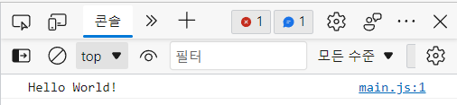
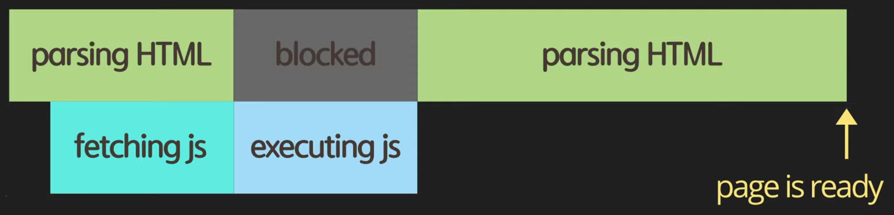
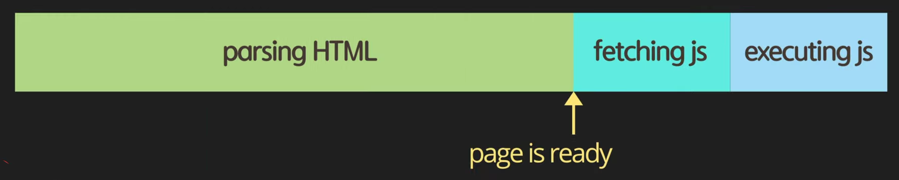
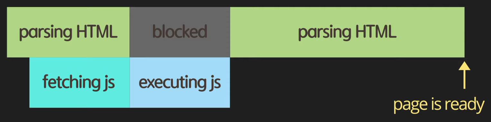
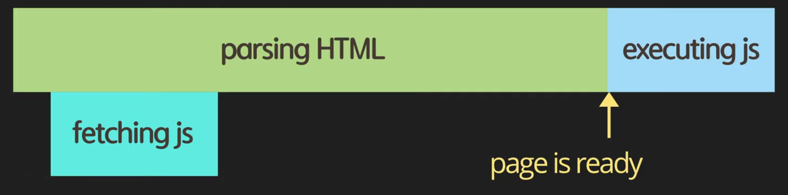
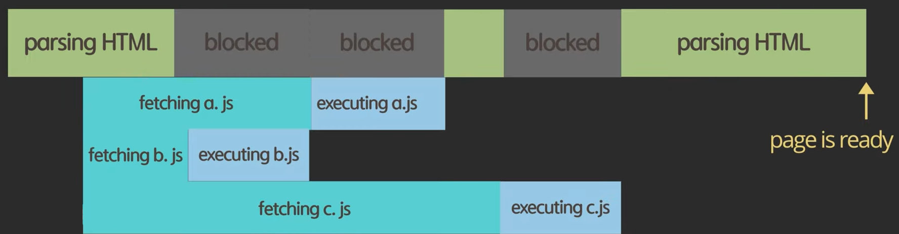
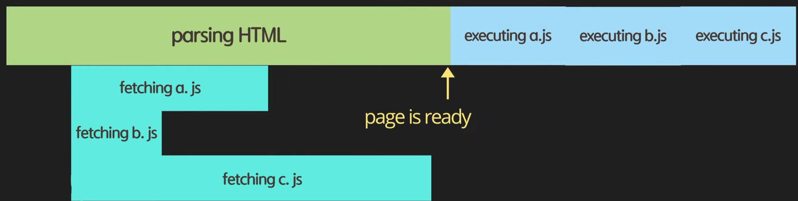

# 2. 콘솔에 출력, script async와 defer의 차이점 및 앞으로 자바스크립트 공부 방향

[자바스크립트 기초 강의 2]: https://www.youtube.com/watch?v=tJieVCgGzhs&amp;list=PLv2d7VI9OotTVOL4QmPfvJWPJvkmv6h-2&amp;index=2

[자바스크립트 공식사이트]: https://www.ecma-international.org/
[자바스크립트 공식사이트]: https://developer.mozilla.org/ko/	"공부할 때 추천"


## Hello World 작성

```
#main.js
console.log('Hello World!')
```


## Preparation

```
$ node main.js
Hello World!
```



- Node.js, web api 둘 다 콘솔에 관련된 API가 있고 이 API의 인터페이스가 동일하기에 console API 중 log라는 함수를 이용해 원하는 메시지를 콘솔창에 출력 가능
- API (Application Program Interface)
  - 자바스크립트에 포함된 아이가 아니라 브라우저가 제공하는 브라우저가 이해할 수 있는 함수들


## Dev Tools

- Elements 탭 
  - HTML 에서 작성한 요소들을 확인하고 검사

- Console 탭 
  - 코드에서 작성한 메시지 확인
  - 자바스크립트 실행 : 동적으로 요소들을 검사하고 붙여넣고 지우는 등 간단한 기능

- Sources 탭
  - 디버깅 할 때 유용하게 사용
  - break point 걸어 디버깅에 사용
- Network 탭
  - Network가 어떻게 발생하는지, 얼마나 많은 사이즈의 데이터가 오고가는 지 검사
- Performance, Memory 등 분석...


## async vs defer

- head + async

  - 

    - ```
      <!DOCTYPE html>
      <html lang="en">
      <head>
          <meta charset="UTF-8">
          <title>Document</title>
          <script src="main.js"></script>
      </head>
      <body>
          
      </body>
      </html>
      ```

    - 이 경우 단점 : js 파일 사이즈가 크고 인터넷이 느리다면 사용자가 해당 웹사이트를 보는 데까지 많은 시간이 소요.

    - 해당 스크립트를 head에 포함하는 것은 좋은 게 아님

- body 끝 부분에 script 추가

  - 

  - ```
    <!DOCTYPE html>
    <html lang="en">
    <head>
        <meta charset="UTF-8">
        <title>Document</title>
    </head>
    <body>
        <div></div>
        <script src="main.js"></script>
    </body>
    </html>
    ```

  - 페이지가 사용자들에게 js를 받기 전에도 준비가 되어서 사용자가 페이지 컨텐츠를 볼 수 있음

  - 웹사이트가 javascript에 굉장히 의존적인 아이라면!! 사용자가 의미있는 컨텐츠를 보기 위해서는 자바스크립트를 이용해 서버에서 있는 데이터를 받아온다든지 DOM요소를 예쁘게 꾸며준다든지 그런 식으로 동작하는 웹사이트라면!! 사용자가 정상적인 페이지를 보기 전까지는 서버에서 자바스크립트를 받아와 실행하는 시간을 기다려야 함

- head + async

  - 

  - ```
    <!DOCTYPE html>
    <html lang="en">
    <head>
        <meta charset="UTF-8">  
        <title>Document</title>
        <script async src="main.js"></script>
    </head>
    <body>
        <div></div>
    </body>
    </html>
    ```

  - async 

    - boolean 타입의 속성 값. 
    - 선언하는 것만으로도 True로 설정이 되어 async 옵션 사용 가능
    - async를 사용하게 되면 브라우저가 HTML을 다운로드 받아서 parsing을 하다가 asyn을 보면 병렬로 main.js 파일을 다운로드 받자 명령 함
    - 다시 parsing하다가 main.js 다운로드가 완료되면 그 때 parsing 하는 것을 멈추고 다운로드된 js 파일을 실행함.
    - 실행 다하고나서 나머지 html 파일을 parsing 하게 됨
    - 장점 : body 끝에 사용하는 것보다 fetching이 parsing하는 동안 병렬적으로 일어나 다운로드 받는 시간을 절약
    - 단점 
      - 자바스크립트가 html이 parsing 되기도 전에 실행이 되기에 만약 자바스크립트 파일에서 Query selector을 이용해서 DOM 요소를 조작한다하면 조작하려고 하는 시점에 html이 우리가 원하는 요소가 아직 정의되어있지 않을 수가 있음. 이 부분이 위험할 수 있음
      - html을 parsing하는 동안에 언제든지 자바스크립트를 실행하기 위해서 멈출 수 있기 때문에 사용자가 페이지를 보는데 시간이 조금 더 걸릴 수 있음

- head + defer

  - 

  - ```
    <!DOCTYPE html>
    <html lang="en">
    <head>
        <meta charset="UTF-8">  
        <title>Document</title>
        <script defer src="main.js"></script>
    </head>
    <body>
        <div></div>
    </body>
    </html>
    ```

  - parsing하다가 script defer을 만나면 main.js를 다운로드 받자라고 명령만 시켜놓고 나머지 html을 끝까지 parsing

  - 마지막에 parsing이 끝난 후 다운로드 되어진 javascript를 실행

- async vs defer

  - head + async

    - 

    - ```
      <head>
          <meta charset="UTF-8">  
          <title>Document</title>
          <script async src="a.js"></script>
          <script async src="b.js"></script>
          <script async src="c.js"></script>
      </head>
      ```

    - async옵션으로 다수의 script를 다운로드 받게 되면 먼저 다운로드 받은 걸 실행하게 됨

    - 즉, 정의된 script 순서와 상관없이 다운로드가 먼저 된 것이 실행되기에 순서에 의존적인 자바스크립트라면 스크립트를 실행하는데 있어 문제가 생길 수 있음

  - head + defer

    - 

    - ```
      <head>
          <meta charset="UTF-8">  
          <title>Document</title>
          <script defer src="a.js"></script>
          <script defer src="b.js"></script>
          <script defer src="c.js"></script>
      </head>
      ```

    - parsing하는 동안 필요한 자바스크립트들을 다 다운로드받아놓은 후 그 다음 순서대로 실행돼서 우리가 정의한 순서가 지켜짐

    - 우리가 원하는대로 스크립트 실행

    - 가장 효율적, 안전


## Use strict!

- 자바스크립트 이용시 제일 윗부분에 `'use strict';` 쓰면 좋음
  - 타입스크립트 사용 시 선언할 필요X
  - 자바스크립트는 유연한 언어. 유연하다는 것은 개발자가 많은 실수를 할 수 있다는 것.
  - 자바스크립트에서는 선언되지 않은 변수에 값을 할당한다든지, 기존에 존재하는 프로토타입을 변경한다든지  이런 비상식적인 게 가능
  - use strict를 선언하게 되면 상식적인 범위 안에서 자바스크립트를 이용할 수 있게 됨
  - 자바스크립트 엔진이 좀 더 효율적으로 좀 더 빠르게 자바스크립트를 분석할 수 있기에 더 나은 성능 기대할 수 있음

