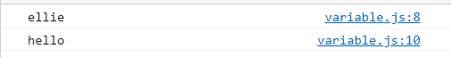
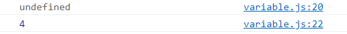
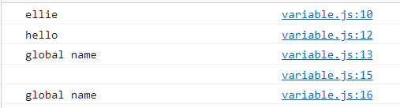
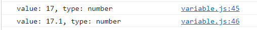

# 3. 데이터타입, data types, let vs var, hoisting

[자바스크립트 기초 강의 3]: https://www.youtube.com/watch?v=OCCpGh4ujb8&amp;list=PLv2d7VI9OotTVOL4QmPfvJWPJvkmv6h-2&amp;index=3


- main.js를 variable.js로 변경


## Variable

- 변수 : 변경될 수 있는 값

  - let (added in ES6)

    - ```
      let name = 'ellie';   // let이라는 키워드를 이용해서 name이라는 변수를 선언. 선언함과 동시에 ellie라는 변수의 값을 할당 
      console.log(name);
      name = 'hello';   /다시 name이라는 변수에 hello라는 값 할당
      console.log(name);
      ```

    - 

- let 전에는?

  - var (don't ever use this!)

    - ```
      console.log(age);
      age = 4;
      console.log(age);
      var age;
      ```

    - 

    - var hoisting (move declaration from bottom to top) : 어디에 선언했나 상관없이 항상 제일 위로 선언을 끌어주는 것.

    - var has no block scope : block을 철저히 무시하는 아이

      - ```
        {
            age = 4;
            var age;
        }
        console.log(age);
        ```

      - 

      - 아무리 저 깊은 곳에 블럭을 이용해서 변수를 선언해도 어디에서나 아무곳에서나 보일 수 있는 것

      - 어느정도 규모가 되면 선언하지도 않은 값들이 할당되어 오는 이상한 일들이 발생 

  - let과 비교

    - ```
      name = 4;
      let name;
      ```

    - 


## Blook scope

- 코드를 {} 안에 작성. 이렇게 하면 블럭 밖에서는 블럭 안의 내용을 볼 수 없게 됨

  - ```
    {
    let name = 'ellie';
    console.log(name);
    name = 'hello';
    console.log(name);
    }
    console.log(name);  -> 밖에서 접근하면 아무 값도 나오지 않음
    ```

- 반대로 블럭을 쓰지않고 file 안에 바로 정의해서 쓰는 정수들을 global scope이라고 부름

  - 어느곳에서나 접근 가능

  - ```
    let globalName = 'global name';
    {
    let name = 'ellie';
    console.log(name);
    name = 'hello';
    console.log(name);
    console.log(globalName);
    }
    console.log(name);
    console.log(globalName);
    ```

  - 

  - 글로벌한 변수들은 application이 실행되는 순간부터 끝날 때까지 항상 메모리에 탑재되어 있기 때문에 최소한으로 쓰는게 좋음
  - 가능하다면 class, 함수, if, for 루프 필요한 부분에서만 정해서 쓰는 게 좋음


## Constant

- 한 번 할당하면 값이 절대 바뀌지 않는 것
- 변수를 이용하면 변수가 메모리 어딘가에 할당된 박스를 가리키고 있어서 포인터를 이용해 값을 계속 바꿔나갈 수 있었으나 Constant는 가리키고 있는 포인터가 잠겨있어 값을 선언함과 동시에 할당한 뒤로는 절대 값을 변경할 수 없음
  - 값이 바뀔 수 있는 것 = Mutable
    - Mutable data type : let 키워드를 이용한 변수
  - 변경이 불가능한 = Immutable
    - Immutable data type : Constant
- favor immutable data type always for a few reasons
  - 보안상
    - 한 번 작성한 값을 다른 해커들이 이상한 코드를 삽입해서 값을 계속해서 변경해 나갈 수 있음. 이걸 방지.
  - thread safety
    - 어플리케이션이 실행되면 한 가지의 프로세스가 할당되고 그 프로세스 안에서는 다양한 thread가 동시에 돌아가면서 어플리케이션을 조금더 효율적으로 빠르게 동작할 수 있도록 도와주는데 이 다양한 thread들이 동시에 변수에 접근해서 값을 변경할 수 있음. 이건 위험. 그렇기에 가능하면 값이 변경되지 않는 걸 사용하는 게 좋음
  - reduce human mistakes


## Variable types

- primitive, single item : 더 이상 작은 단위로 나눠질 수 없는 한 가지 아이템

  - number, string, boolean, null, undefined, symbol

- object type : single item들을 여러 개 묶어서 한 단위, 박스로 관리할 수 있게 해주는 것

- function

  - first-class function 지원이 돼 : 이 프로그래밍 언어에서는 function도 다른 데이터 타입처럼 변수에 할당이 가능하고 함수에 parameter 인자로도 전달이 되고 함수에 return type으로도 function을 return할 수 있는 게 가능하다

- data types for number 

  - C언어 (low level)

    - ```
      int main() {
      	short a = 12;       // 2bytes
      	int a = 12;         // 4bytes
      	long b = 1234;      // 8bytes
      	float d = 1.2f;     // 4bytes
      	double e = 8.2;     // 16bytes
      	return 0;
      }
      ```

    - short, int, long : 정수 할당

    - float, double : 소수점 할당

  - Java

    - ```
      class main {
      	public static void main(String[] args) {
      	byte a = 12;
      	short b = 12;
      	long c = 12; 
      	int d = 12;
      	float e = 1.2f;
      	double f = 1.2;
      	}
      }
      ```

  - Java script

    - ```
      let a = 12;
      let b = 1.2;
      ```

  - TypeScript

    - ```
      let a: number = 12;
      let b: number = 1.2;
      ```

- ```
  const count = 17;  //integer
  const size = 17.1; //decimal number
  console.log(`value: ${count}, type: ${typeof count}`);
  console.log(`value: ${size}, type: ${typeof size}`);
  ```

  - ​	

- number - special numeric values : infinity, -infinity, NaN

  - ```
    const infinity = 1 / 0;
    const negativeInfinity = -1 / 0;
    const nAn = 'not a number' / 2;
    console.log(infinity);
    console.log(negativeInfinity);
    console.log(nAn);
    ```

  - 

  - 다양한 계산을 해야할 때 나누고자 하는 값이 0인지 숫자인지 아닌지 확인하지 않고 연산을 하게되면 숫자가 아닌 infinity나 nAn를 받을 수 있음. 사용자에게 에러발생할 수 있기에 연산할 때 값이 valid한 값인지 확인하고 연산하는 게 중요
