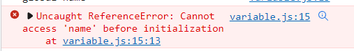

# 3. 데이터타입, data types, let vs var, hoisting

[자바스크립트 기초 강의 3]: https://www.youtube.com/watch?v=OCCpGh4ujb8&amp;list=PLv2d7VI9OotTVOL4QmPfvJWPJvkmv6h-2&amp;index=3


- main.js를 variable.js로 변경


## Variable

- 변수 : 변경될 수 있는 값

  - let (added in ES6)

    - ```
      let name = 'ellie';   // let이라는 키워드를 이용해서 name이라는 변수를 선언. 선언함과 동시에 ellie라는 변수의 값을 할당 
      console.log(name);
      name = 'hello';   /다시 name이라는 변수에 hello라는 값 할당
      console.log(name);
      ```

    - 

- let 전에는?

  - var (don't ever use this!)

    - ```
      console.log(age);
      age = 4;
      console.log(age);
      var age;
      ```

    - 

    - var hoisting (move declaration from bottom to top) : 어디에 선언했나 상관없이 항상 제일 위로 선언을 끌어주는 것.

    - var has no block scope : block을 철저히 무시하는 아이

      - ```
        {
            age = 4;
            var age;
        }
        console.log(age);
        ```

      - 

      - 아무리 저 깊은 곳에 블럭을 이용해서 변수를 선언해도 어디에서나 아무곳에서나 보일 수 있는 것

      - 어느정도 규모가 되면 선언하지도 않은 값들이 할당되어 오는 이상한 일들이 발생 

  - let과 비교

    - ```
      name = 4;
      let name;
      ```

    - 


## Blook scope

- 코드를 {} 안에 작성. 이렇게 하면 블럭 밖에서는 블럭 안의 내용을 볼 수 없게 됨

  - ```
    {
    let name = 'ellie';
    console.log(name);
    name = 'hello';
    console.log(name);
    }
    console.log(name);  -> 밖에서 접근하면 아무 값도 나오지 않음
    ```

- 반대로 블럭을 쓰지않고 file 안에 바로 정의해서 쓰는 정수들을 global scope이라고 부름

  - 어느곳에서나 접근 가능

  - ```
    let globalName = 'global name';
    {
    let name = 'ellie';
    console.log(name);
    name = 'hello';
    console.log(name);
    console.log(globalName);
    }
    console.log(name);
    console.log(globalName);
    ```

  - 

  - 글로벌한 변수들은 application이 실행되는 순간부터 끝날 때까지 항상 메모리에 탑재되어 있기 때문에 최소한으로 쓰는게 좋음
  - 가능하다면 class, 함수, if, for 루프 필요한 부분에서만 정해서 쓰는 게 좋음


