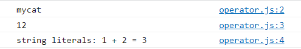
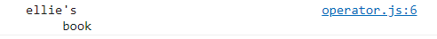
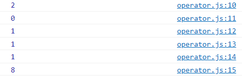
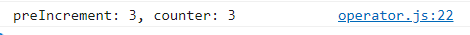

# 3. 코딩의 기본 operator, if, for loop 코드리뷰 팁

[자바스크립트 기초 강의 4]: https://www.youtube.com/watch?v=YBjufjBaxHo&amp;list=PLv2d7VI9OotTVOL4QmPfvJWPJvkmv6h-2&amp;index=4


## 1. String concatenation (문자연결)

- 문자열과 문자열을 합쳐 새로운 문자열을 만들 수 있음

- 문자열에 숫자를 더하게 되면 숫자가 문자열로 변환되어 합쳐짐

- `기호를 활용해서 string literals도 만들 수 있음

  - $ 이용하면 변수값을 계산해서 string으로 포함해서 문자열을 만들게 됨
  - string literals의 좋은 점은 줄바꿈을 하거나 중간에 특수기호를 이용해도 그대로 문자열로 변환되어 나오게 된다는 것

- ```
  // 1. String concatenation
  console.log('my'+'cat');
  console.log('1'+2);
  console.log(`string literals: 1 + 2 = ${1 + 2}`)
  ```

  - 

- ```
  console.log("ellie's \n \t book")
  ```

  - 

- 

## 2. Numeric operators (숫자 연산자)

- ```
  console.log(1 + 1);  //add
  console.log(1 - 1);  //substract
  console.log(1 / 1);  //divide
  console.log(1 * 1);  //multiply
  console.log(5 % 2);  //remainder
  console.log(2 ** 3);  //exponentiation
  ```

  - 


## 3. ++, - operators

- ```
  let counter = 2;
  const preIncrement = ++counter;
  // counter = counter + 1;
  // preIncrement = counter;
  console.log(`preIncrement: ${preIncrement}, counter: ${counter}`);
  ```

- 


## 4. = operators


## 5. <= operators


## 6. Logical operators (||, &&, !) (논리 연산자)


## 7.Equality operators (==, ===)


## 8. Conditional operators : if (조건 연산자)


## 9. Ternary(?) operators (삼항 연산자)


## 10. Switch operators (switch 연산자)


## 11. while operators (while 반복문)


## 12. do-while loop (do-while 반복문)


## 13. for loop (for 반복문)


## 14. nested loop (중첩 반복문)

