# 4. 코딩의 기본 operator, if, for loop 코드리뷰 팁

[자바스크립트 기초 강의 4]: https://www.youtube.com/watch?v=YBjufjBaxHo&amp;list=PLv2d7VI9OotTVOL4QmPfvJWPJvkmv6h-2&amp;index=4


## 1. String concatenation (문자연결)

- 문자열과 문자열을 합쳐 새로운 문자열을 만들 수 있음

- 문자열에 숫자를 더하게 되면 숫자가 문자열로 변환되어 합쳐짐

- `기호를 활용해서 string literals도 만들 수 있음

  - $ 이용하면 변수값을 계산해서 string으로 포함해서 문자열을 만들게 됨
  - string literals의 좋은 점은 줄바꿈을 하거나 중간에 특수기호를 이용해도 그대로 문자열로 변환되어 나오게 된다는 것

- ```
  // 1. String concatenation
  console.log('my'+'cat');
  console.log('1'+2);
  console.log(`string literals: 1 + 2 = ${1 + 2}`)
  ```

  - 

- ```
  console.log("ellie's \n \t book")
  ```

  - 

- 

## 2. Numeric operators (숫자 연산자)

- ```
  console.log(1 + 1);  //add
  console.log(1 - 1);  //substract
  console.log(1 / 1);  //divide
  console.log(1 * 1);  //multiply
  console.log(5 % 2);  //remainder
  console.log(2 ** 3);  //exponentiation
  ```

  - 


## 3. ++, - operators

- ```
  let counter = 2;
  const preIncrement = ++counter;
  // counter = counter + 1;
  // preIncrement = counter;
  console.log(`preIncrement: ${preIncrement}, counter: ${counter}`);
  ```

- 

- ```
  const postIncrement= counter++;
  // postIncrement = counter;
  // counter = counter + 1;
  console.log(`postIncrement: ${postIncrement}, counter: ${counter}`);
  ```

- 

- ```
  const preDecrement = --counter;
  console.log(`preDecrement: ${preDecrement}, counter: ${counter}`);
  const postDecrement = counter--;
  console.log(`postDecrement: ${postDecrement}, counter: ${counter}`);
  ```

- 


## 4. = operators

- ```
  let x = 3;
  let y = 6;
  x += y; // x = x + y;
  x -= y;
  x *= y;
  x /= y;
  ```

  


## 5. <= operators

- ```
  // 5. Comparison operators
  console.log(10 < 6);  // less than
  console.log(10 <= 6);  // less than or equal
  console.log(10 > 6);  // greater than
  console.log(10 >= 6);  //greater than or equal
  ```

  


## 6. Logical operators (||, &&, !) (논리 연산자)

- ```
  // 6. Logical operators: || (or), && (and), !(not) (논리 연산자)
  const value1 = false;
  const value2 = 4 < 2;
  ```

- ```
  // || (or)
  console.log(`or: ${value1 || value2 || check()} `);
  
  function check() {
      for (let i = 0; i < 10; i++) {
          //wasting time
          console.log('🙃');
      }
      return true;
  ```

- 

- or 연산자는 처음으로 true가 나오면 거기서 멈추고 true값 출력

- and 연산자는 모두 true여야 true 출력

  - ```
    // && (and), finds the first falsy value
    console.log(`and: ${value1 && value2 && check()}`);
    ```

  - value1이 false가 나오게 되면 뒤는 상관없이 무조건 false

- or, and 경우 heavy한 operation일수록 제일 뒤에서 체크

- and는 간편하게 null 체크할 때도 많이 씀

  - object가 null이면 false가 되어 뒤가 실행이 안됨

  - 즉, nulllobject가 null이 아닐 때만 object의 something이라는 value를 받아오게 됨

  - 코드로 풀어보면

    - ```
      if (nullableObject != null) {
          nullableObject.something;
      }
      ```


- not 연산자는 값을 반대로 바꿔줌

  - value1이 true이기 때문에 false로 바꿔서 변경

  - ```
    console.log(!value1)
    ```

  - 


## 7.Equality operators (==, ===)

- ```
  // 7. Equality
  const stringFive = '5';
  const numberFive = 5;
  
  // == loose equality, with type conversion
  console.log(stringFive == numberFive);
  console.log(stringFive != numberFive);
  
  // === strict equality, no type conversion
  console.log(stringFive === numberFive);
  console.log(stringFive !== numberFive);
  ```

- 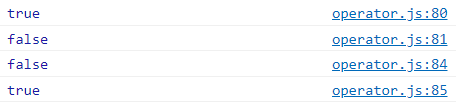

- == : 타입을 변경해서 검사하기에 loose equality라고 불림

- === : 타입을 신경써서 검사하기에 strict equality라고 불림

- 그렇기에 코딩할 때 strict equality를 써서 검사하는 게 좋음 

- ```
  //object equality by reference
  const ellie1 = { namme: 'ellie2' };
  const ellie2 = { namme: 'ellie2' };
  const ellie3 = ellie1;
  console.log(ellie1 == ellie2);
  console.log(ellie1 === ellie2);
  console.log(ellie1 === ellie3);
  ```

  - object는 메모리에 탑재될 때 reference형태로 저장됨.
  - ellie1와 ellie2는 똑같은 데이터가 들어있는 object지만 실제로 메모리에는 1과 2에 다른 reference가 들어있음.
  - 다른 reference는 서로 다른 object를 가리키고 있음
  - ellie3에는 ellie1의 reference가 할당되어 있기에 똑같은 reference를 가지고 있는 것.
  - 
    - ellie1과 ellie2는 각각 다른 reference가 저장되어있기에 reference가 달라 false로 출력
    - ellie1과 ellie2는 똑같은 타입이든 아니든 reference값이 다르기에 false
    - ellie1과 ellie3는 똑같기에 true.

- 배운 걸 확인해볼 시간!!

  - ```
    //equality - puzzler
    console.log(0 == false);
    console.log(0 === false);
    console.log('' == false);
    console.log('' === false);
    console.log(null == undefined);
    console.log(null === undefined);
    ```

  - 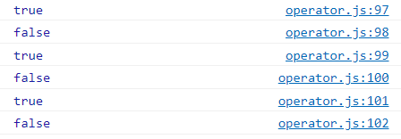

    - 0, null, undefined, empty stirng은 false로 간주, true
    - 0dms booelan타입이 아니기 때문에 false
    - empty 문자열은 false, true
    - empty 문자열은 boolean 타입이 아니기 때문에, false
    - null과 undefined는 같은 것으로 간주
    - null과 undefined는 다른 타입


## 8. Conditional operators : if (조건 연산자)

- statemet가 true면 그 안에 있는 block을 실행

- ```
  // 8. Coditional operators:if
  // if, else if, else
  const name = 'coder'
  if (name === 'ellie') {
      console.log('Welcome, Ellie!');
   } else if (name === 'coder') {
       console.log('You are amazing coder');
   } else {
       console.log('unknown')
   }
  ```

  - 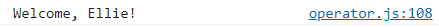

- ```
  const name = 'coder'
  if (name === 'ellie') {
      console.log('Welcome, Ellie!');
   } else if (name === 'coder') {
       console.log('You are amazing coder');
   } else {
       console.log('unknown')
   }
  ```

  - 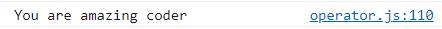

- ```
  const name = 'df'
  if (name === 'ellie') {
      console.log('Welcome, Ellie!');
   } else if (name === 'coder') {
       console.log('You are amazing coder');
   } else {
       console.log('unknown')
   }
  ```

  - 


## 9. Ternary(?) operators (삼항 연산자)

- if를 조금 더 간단하게 쓸 수 있는 Ternary operators

- statement가 true면  ?다음에 있는 것을 실행, 아니면 그 다음에 나오는 것을 실행

- ```
  // 9. Ternary operator:?
  //  condition ? value1 : value2;
  console.log(name === 'ellie' ? 'yes' : 'no');
  ```

  - 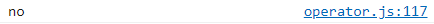

- Ternary operators를 계속 묶어 쓰면 가독성이 떨어지기에 if나 switch를 쓰는게 맞음

- Ternary operators는 간단할 때만!


## 10. Switch operators (switch 연산자)

- ```
  // 10. Switch statement
  // use for multiple if checks
  // use for enum-like value check
  // use for multiple type checks in TS
  const browser = 'IE';
  switch (browser) {
      case 'IE':
          console.log('go away!');
          break;
      case 'Chrome':
          console.log('love you!');
          break;
      case 'Firefox':
          console.log('love you!');
          break;
      default:
          console.log('same all!');
          break;
  }
  ```

  - 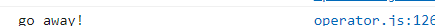
  - switch 안에 있는 값(예시에서는 browser의 값)이  IE이면 다음 문장 실행 후 멈춤

- Chrome이랑 Firefox일 때 똑같은 메세지를 출력하고 있기애 반복할 필요없이 case를 연달아 적으면 됨

  - ```
    const browser = 'IE';
    switch (browser) {
        case 'IE':
            console.log('go away!');
            break;
        case 'Chrome':
        case 'Firefox':
            console.log('love you!');
            break;
        default:
            console.log('same all!');
            break;
    }
    ```

- if에서 else if를 반복한다면 switch 사용을 고려하는 게 좋음

- 나중에 TypeScript에서 정해져있는 타입을 검사하거나 enum 비슷한 걸 검사할때는 switch 쓰는 것이 가독성이 좋음


## 11. while operators (while 반복문)

- ```
  // 11. Loops
  // while loop, whiel the condition is truthy,
  // body code is executed.
  let i = 3;
  while (i>0) {
      console.log(`while: ${i}`)
      i--;
  }
  ```

  - 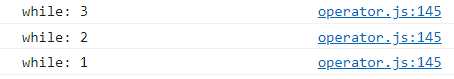


## 12. do-while loop (do-while 반복문)

- block을 실행한 다음에 조건이 맞는지 안맞는지 검사

- ```
  / do while loop, body code is executed first,
  // then check the condition.
  do {
      conseole.log(`do while: ${i}`);
      i--;
  } while (i>0);
  ```

  - 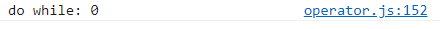

- block을 먼저 실행하고 싶다면 do-while반복문, 조건이 맞을떄만 block을 실행하고 싶다면 while 반복문


## 13. for loop (for 반복문)

- ```
  // for loop, for(begin; condition; step)
  for (i = 3 ; i > 0 ; i--) {
      console.log(`for: ${i}`);
  }
  
  for (let i = 3; i > 0; i = i - 2) {
      // inline variable declaration
      console.log('inline variable for: ${i}')
  }
  ```

  - 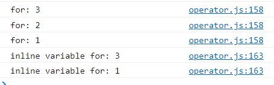

- beign을 처음에 한번만 호출하고 그 다음 block을 실행하기 전에 conditon이 맞는지 안맞는지 검사한 후 block이 다 실행이 되면 step 실행

- block 안에 let이라는 지역 변수를 선언해서 작동해도 좋음

## 14. nested loop (중첩 반복문)

- ```
  // nested loops
  for (let i = 0; i < 10; i++) {
      for (let j = 0; j < 10; j++) {
          console.log(`i: ${i}, j:${j}`);
      }
  }
  ```

  - 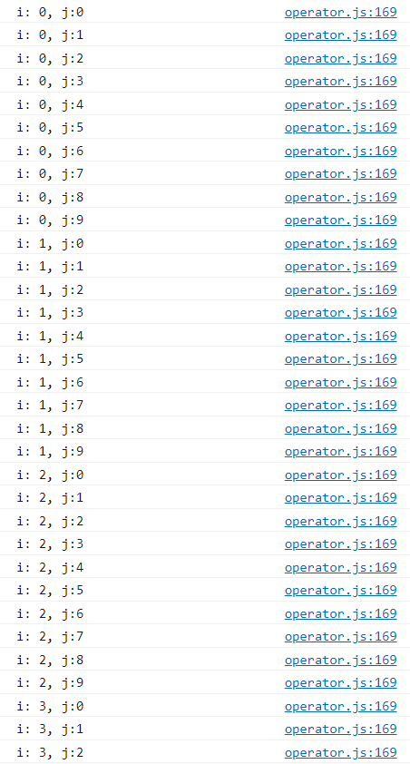

- for문 안에 다시 for문을  작성하게 되면 i가 0일 때 j를 0부터 9까지 돌리고 그 후 i가 1일 때 j를 0부터 9까지 돌리는....
- O(n²) -> cpu에 안좋기에 피하는 게 좋음


## Quiz

- break, continue
  - 1. iterate from 0 to 10 and print only even numbers (use continue)
       - continue : 지금 것만 스킵하고 다시 다음 스텝으로 넘어가는 것
       
       - ```
         // 1. iterate from 0 to 10 and print only even numbers (use continue)
         for (let i = 0; i < 11; i++) {
             if (i % 2 !== 0) {
                 continue;
             }
             console.log(`q1. ${i}`);
         }
         ```
       
       - 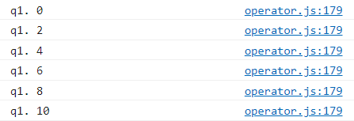
  - 2. iterate from 0 to 10 and print numbers untill reaching 8 (use break)
       - break : loof를 완전히 끝내는 것
       
       - ```
         // 2. iterate from 0 to 10 and print numbers untill reaching 8 (use break)
         for (let i = 0; i < 11; i++) {
             if (i > 8) {
                 break;
             }
             console.log(`q2.${i}`);
         }
         ```
       
       - 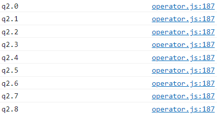
