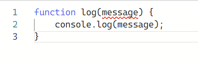

# 5. Arrow Function은 무엇인가? 함수의 선언과 표현

[자바스크립트 기초 강의 5]: https://www.youtube.com/watch?v=e_lU39U-5bQ&amp;list=PLv2d7VI9OotTVOL4QmPfvJWPJvkmv6h-2&amp;index=5


## Function?

- 프로그램을 구성하는 기본적인 building block
- subprogram이라고도 불리며 여러번 재사용이 가능하다는 장점이 있음
- 대체적으로 한 가지의 task나 어떤 값을 계산하기 위해 쓰여지고 있음


## Function declaration

- JavaScript에서 function을 정의하는 방법

  - function이라는 키워드를 이용하고 함수의 이름을 지정한 후 parameter을 쭉 나열한 다음 body 함수 안에 기본적인 business logic을 작성한 다음 return을 해주면 됨
    - `function name(param1, param2) {body ... return; }
  - 하나의 함수는 한 가지의 이름만
  - 함수의 이름을 작성할 때는 무언가를 동작하는 것이기에 doSomething, command, verb 형태로 지정해야함
  - 함수의 이름을 지정하기가 어렵다면 혹시 함수 안에서 너무 많은 것들을 하고 있지 않은지 생각할 필요가 있음
    - e.g. createCardAndPoint -> createCard, createPoint
  - JS에서 function은 object
    - function을 변수에 할당할 수 있고 parameter로 전달이 되고 함수를 return할 수도 있게 됨

- ```
  function printHello() {
      console.log('Hello');
  }
  printHello();
  ```

  - 

- ```
  function log(message) {
      console.log(message);
  }
  log('Hello@');
  ```

  - 

  - JS에는 Type이 없기 때문에 함수 자체의 interface만 보았을 때 message가 string을 전달해야 하는지 숫자도 전달해야되는지 명확하지 않음

  - 그래서 사용하는 사람이 숫자를 전달할 수도 있음. 다행히 숫자가 문자열로 변환되어 log가 출력

    - ```
      log(1234);
      ```

    - 

    - but, 다른 함수에서 Type이 중요한 경우에는 JS가 난해할 수 있음

- TypeScript (https://www.typescriptlang.org/play?#code/GYVwdgxgLglg9mABAGzgcwBQFsCmBnPAQzRwEpEBvAKEVsQgTzmRwDpVNcDiyBuKgL5A)

  - 
  - 

  - TypeScript에서는 parameter나 return 타입에 타입을 명시하도록 되어져있음
  - 
  - 


## Parameters

- premitive 타입의 경우 메모리에 value가 그대로 저장되어 있기에 value가 전달

- object의 경우 메모리에 reference가 저장되어 reference가 전달

- ```
  // 2. Parameters
  // premitive parameters: passed by value
  // object parameters: passed by reference
  function changeName(obj) {
      obj.name = 'coder';
  }
  const ellie = { name: 'ellie' };
  changeName(ellie);
  console.log(ellie);
  ```

  - changeName이라는 function은 전달된 obj의 이름을 무조건 coder로 변경하는 함수
  - ellie라는 const를 정의한 다음에 elie라는 obj를 만들어서 할당해주면 메모리에는 obj가 만들어진 reference가 메모리에 들어가게 되고 이 reference는 obj를 메모리 어딘가에 가르키고 있음
  - 그래서 changeName(ellie)를 전달하게 되면 전달된 ellie. ellie가 가리키고 있는 곳의 이름을 coder로 변경
  - 출력하게 되면 ellie의 이름이 coder로 변경된 것을 볼 수 있음
  - obj는 reference로 전달되기 때문에 함수 안에서 obj의 값을 변경하게 되면 그 변경된 사항이 그대로 메모리에 적용이 되기에 추후에 변경된 사항을 확인 가능
  - .PNG)


## Default parameters (added in ES6)

- ```
  function showMessage(message, from) {
      console.log(`${message} by ${from}`);
  }
  showMessage('Hi!');
  ```

- 

- parameter 옆에 원하는 default 값을 지정해놓으면 사용자가 parameter을 전달하지 않을 때  이 값이 대체되어 사용됨

  - ```
    function showMessage(message, from = 'unknown') {
        console.log(`${message} by ${from}`);
    }
    showMessage('Hi!');
    ```

  - 


## Rest Parameters (added in ES6)

- `...`을 입력하게 되면 Rest parameters라고 부름. 배열형태로 전달

- ```
  function printAll(...args) {
      for (let i = 0; i < args.length; i++) {
          console.log(args[i]);
      }
  }
  printAll('dream', 'coding', 'ellie');
  ```

  - 

  - 같은 값 출력

  - ```
    function printAll(...args) {
        for (let i = 0; i < args.length; i++) {
            console.log(args[i]);
        }
    
        for (const arg of args) {
            console.log(arg)
        }
    
        args.forEach((arg) => console.log(arg));
    }
    printAll('dream', 'coding', 'ellie');
    ```


- function은 object의 일종이다.
  - printAll이라는 함수를 선언하고 `.`을 누르면 함수가 object로 전환이 되기에 printAll의 속성값을 확인해 볼 수 있음
    - 


## Local scope

- 밖에서는 안이 보이지 않고 안에서만 밖을 볼 수 있다.

- block 안에서 함수를 선언하게 되면 이것은 지역 변수

  - ```
    let globalMessage = 'global';  // global variable
    function printMessage() {
        let message = 'hello';
        console.log(message);  // local variable
        console.log(globalMessage);
    }
    printMessage();
    ```

    - 
    - 지역 변수는 지역적인 것이기 때문에 안에서만 접근이 가능
    - 메시지를 밖에서 출력하면 error가 발생
    - 안에서는 global message 볼 수 있고 출력이 가능

  - ```
    let globalMessage = 'global';  // global variable
    function printMessage() {
        let message = 'hello';
        console.log(message);  // local variable
        console.log(globalMessage);
        function printAnother() {
            console.log(message);
            let childMessage = 'hello';
        }
        console.log(childMessage);
    }
    printMessage();
    ```

    - 
    - 자식은 부모에게서 정의된 메시지를 확인할 수 있음. 하지만 자식 안에 정의된 메시지는 부모 상위 위에서 보려고 하면 error
    - 중첩된 함수에서 자식의 함수가 부모함수에 정의된 변수들에 접근이 가능한 게 치ㅐㄴㄷㄱ


## Return

- 함수에서는 parameter로 값들을 전달받아서 계산된 값을 return 받을 수 있음

  - ```
    function sum(a, b) {
        return a + b;
    }
    const result = sum(1, 2);  // 3
    console.log(`sum: ${(1,2)}`);// 6. Return a value
    function sum(a, b) {
        return a + b;
    }
    const result = sum(1, 2);  // 3
    console.log(`sum: ${sum(1, 2)}`);
    ```

    - 

- return타입이 없는 함수들은 `return undefined;`가 들어가있는 것과 똑같음


## Early Return

- upgradeUser이라는 함수 안에서 user의 point가 10이상일 경우 무언가 upgrade하는 logic이 있다면 block안에서 logic을 주로 작성하는데 이러면 가독성이 떨어짐

  - ```
    // bad
    function upgradeUser(user) {
        if (user.point > 10) {
            // long upgrade logic...
        }
    }
    ```

- 이럴 경우 if, else를 번갈아가며 쓰는 것 보다는 조건이 맞지 않을 때는 빨리 return을 해서 함수를 종료하고 조건이 맞을 때만 그 다음에 와서 필요한 logic들을 쭉 실행하는 것이 더 좋음

  - ```
    // good
    function upgradeUser(user) {
        if (user.point <= 10) {
            return;
        }
        // long upgrade logic...
    }
    ```

- 코드를 작성할 때 조건이 맞지않는 경우, 값이 undefined인 경우, 값이 -1인 경우 빨리 return을 하고 필요한 logic들을 그 뒤에 작성하는 것이 좋음
