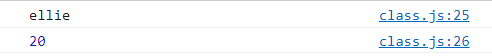
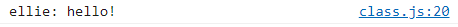
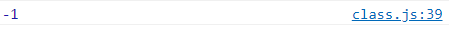
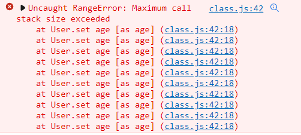
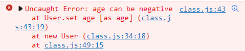
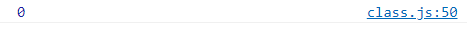

# 클래스와 오브젝트의 차이점(class vs object), 객체지향 언어 클래스 정리 (JavaScript ES6)

[자바스크립트 기초 강의 6]: https://www.youtube.com/watch?v=_DLhUBWsRtw&amp;list=PLv2d7VI9OotTVOL4QmPfvJWPJvkmv6h-2&amp;index=6

- class나 object가 없다면?

  - 우리가 정의한 변수들이 여기저기 떠다니면서 규모있는 프로젝트 만들기 힘들어질 것임

  - class는 조금이라도 연관있는 데이터를 한데묶어놓는 컨테이너 같은 아이

  - class 안에는 속성(field)과 행동(method)가 들어있음

    - ```
      class person{
      	name;
      	age;
      	speak();
      }
      ```

      - name, age : 속성
      - speak : 행동

    - data class : class 안에 method는 들어있지 않고 데이터(field)만 들어있는 경우

  - 관련있는 변수나 함수들을 묶어놓은 것을 class라 하고 class 안에서도 내부적으로 보여지는 변수와 밖에서 볼 수 있는 변수들을 나누어서 이런 것들을 캡슐화라 함

  - class를 이용해서 상속과 다양성이 일어날 수 있는데 이런 모든 것이 가능한 게 객체지향 언어

- class
  - template : 청사진이라고도 불림 
  - declare once : 한 번만 선언
  - no data in : class 자체에는 데이터가 들어있지 않고 template만 정의. 이런 class에는 요런 data가 들어올 수 있어라고 정의

- object
  - class를 이용해서 실제로 data를 넣어서 만드는 것
  - instance of a class : class를 이용해서 새로운 instance 생성
  - created many times : class이용해서 굉장히 많이 만들 수 있음
  - data in : class는 정의만 한 것이라서 실제로 memory에 올라가진 않지만 data를 넣은 object는 memory에 올라가게 됨


## Class?

- ```
  'use strict';
  // Object-oriendted programming
  // class: template
  // object: instance of a class
  // JavaScript classes
  //  - introduced in ES6
  //  - syntactical sugar over prototype-based inheritance
  ```


## Class 선언

- ```
  // 1. Class declarations
  class Person {
      // constructor
      constructor(name, age) {
          // fields
          this.name = name;
          this.age = age;
      }
      
      // methods
      speak() {
          console.log(`${this.name}: hello!`);
      }ㄴ
  }
  ```

  - class라는 키워드를 이용해서 Person이라는 class를 만들고 constructor를 이용해서 나중에 object를 만들 때 필요한 데이터를 전달
  - 전달받은 데이터를 class에 존재하는 두 가지 fields인 name과 age에 전달된 data를 할당
  - speak이라는 method도 존재. speak method 안에를 보면 class에 있는 this.name을 출력하며 hello!인사


## Object 생성

- ```
  const ellie = new Person('ellie', 20);
  console.log(ellie.name);
  console.log(ellie.age);
  ellie.speak();
  ```

  - 새로운 object를 만들 때는 new라는 keyword를 씀. 그래서 새로운 사람을 만듦
  - constructor 안에는 name이랑 age라는 data가 전달. 이름은 'ellie', 나이는 20살로 새로운 object만듦.
  - 확인해보기위해 console에 찍어봄
    - 
  - method인 speak을 이용하면 함수 호출 가능.
    - 


## Getter & Setter

- ```
  // 2. Getter and setters
  class User {
      constructor(firstName, lastName, age) {
          this.firstName = firstName;
          this.lastName = lastName;
          this.age = age;
      }
  }
  
  const user1 = new User('Steve', 'Job', -1);
  console.log(user1.age);
  ```

  - 새로운 user을 만들면서 나이를 실수로 -1로 지정. 객체지향적 관점으로 봤을 때 말이 안됨. 이럴 때 방어적인 자세로 만들 수 있도록 해주는 게 Getter&Setter
  - 

- get이라는 keyword를 이용해서 값을 return하고 set이라는 keyword를 이용해서 값을 설정. set은 값을 설정하기 때문에 value를 받아와야함. 

  - ```
    class User {
        constructor(firstName, lastName, age) {
            this.firstName = firstName;
            this.lastName = lastName;
            this.age = age;
        }
    
        get age() {
            return this.age;
        }
    
        set age(value) {
            this.age = value;
        }
    }
    ```

  - 이렇게 하면 call stack이 초과되었다는 error가 발생

    - 

    - setter 안에서 전달된 value를 this.age에 할당할 때 메모리의 값을 update하는 것이 아니라 setter를 호출하게 됨. 즉, setter로 다시 돌아와서 문장이 또 다시 setter를 호출하고 계속 무한정 반복

      - `this.age` 
        - age란 getter를 설정하는 순간 this.age는 메모리에 올라가있는 데이터를 읽어오는 곳이 아니라 바로 getter를 호출하게 됨
      - `= age;`
        - 그리고 setter를 정의하는 순간 값을 할당할 때 메모리의 값을 할당하는 것이 아니라 setter를 호출하게 됨

    - 이것을 방지하려면 getter와 setter 안에서 쓰여지는 변수 이름을 다른 것으로 만들어 줘야 함.

      - ```
        class User {
            constructor(firstName, lastName, age) {
                this.firstName = firstName;
                this.lastName = lastName;
                this.age = age;
            }
        
            get age() {
                return this._age;
            }
        
            set age(value) {
                this._age = value;
            }
        }
        ```

- User라는 class 안에는 firstName, lastName, _age라는 총 3개의 field가 있음. 이제는 setter가 있기 때문에 -값을 보내면 경고를 띄울 수 있음.

  - ```
    class User {
        constructor(firstName, lastName, age) {
            this.firstName = firstName;
            this.lastName = lastName;
            this.age = age;
        }
    
        get age() {
            return this._age;
        }
    
        set age(value) {
            if (value < 0) {
                throw Error('age can be negative');
            }
            this._age = value;
        }
    }
    ```

    - 

- 좀 더 젠틀하게 원한다면 값이 -라면 0을 쓰고 아니면 지정된 value를 쓰게 해도됨.

  - ```
    // 2. Getter and setters
    class User {
        constructor(firstName, lastName, age) {
            this.firstName = firstName;
            this.lastName = lastName;
            this.age = age;
        }
    
        get age() {
            return this._age;
        }
    
        set age(value) {
            this._age = value < 0 ? 0 : value;
        }
    }
    ```

  - 

- field는 기호가 들어간 age가 있지만 .age라고 호출할 수 있는 것 .age에 값을 할당할 수 있는 것은 내부적으로 getter와 setter를 이용하기 때문


