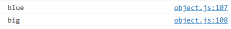

# 오브젝트 넌 뭐니? (JavaScript ES6)

[자바스크립트 기초 강의 7]: https://www.youtube.com/watch?v=1Lbr29tzAA8&amp;list=PLv2d7VI9OotTVOL4QmPfvJWPJvkmv6h-2&amp;index=7


## Object란?

[MDN Object]: https://developer.mozilla.org/ko/docs/Web/JavaScript/Reference/Global_Objects/Object

- primitive type은 변수 하나당 값을 하나만 담을 수 있음

- ```
  // Objects
  // one of the JavaScript's data types.
  // a collection of related data and/or functionality.
  // Nearly all objects in JavaScript are instances of Object
  
  const name = 'ellie';
  const age = 4;
  print(name, age);
  function print(name, age) {
      console.log(name);
      console.log(age);
  }
  ```

  - name이라는 변수에는 'ellie' string이 들어있고 age에는 number 4가 들어있음

  - 그래서 이 둘을 출력하고자 하는 함수를 만들고 싶다면 name, age를 각각 parameter로 전달해줘야함

  - 함수를 정의해서 쓸 때도 두 가지의 parameter을 받아올 수 있도록 만들어야 함

    - 문제 : address, full name 등 인자가 더 많아지게 되면 추가해야하는 것들이 많아짐. 관리도 힘들고 logical하게 group으로 묶어서 생각할 수 없음

    - 이것을 개선하고자 object를 씀

      - ```
        const ellie = { name: 'ellie', age: 4 };
        ```

      - 

- object로 관리

  - ```
    function print(person) {
        console.log(person.name);
        console.log(person.age);
    }
    
    const ellie = { name: 'ellie', age: 4 };
    print(ellie);
    ```

  - name, age로 따로 받지않고 person이라는 data를 받아서 person에 이름과 나이를 출력

  - 호출할 때도 ellie만 전달

- ``` 
  const obj1 = {}; // 'object literal' syntax
  const obj2 = new Object(); // 'object constructor' syntax
  ```

  - object 만드는 방법은 {}을 이용하거나 new라는 키워드를 이용해서 class template를 이용

- JavaScript는 동적으로 타입이 Runtime 때 결정되는 언어
  - Runtime : 프로그램이 동작하고 있을 때
  
  - 그래서 뒤늦게 하나의 property를 추가할 수 있음
    - 이미 name, age라는 object를 정의했음에도 불구하고 저 뒤에서 뒤늦게 다시 추가할 수 있음.
  
    - 나중에 유지보수 힘들고 생각지도 못한 error 발생할 수 있음.
  
    - ```
      // with JavaScript magic (dynamically typed language)
      // can add properties later
      ellie.hasJob = true;
      console.log(ellie.hasJob);
      ```
  
    - 
  
  - 삭제도 가능
  
    - ```
      // can delete properties later
      delete ellie.hasJob;
      console.log(ellie.hasJob);
      ```
  
    - 
  
- object는 key와 value의 집합체

  - object는 key,우리가 접근할 수 있는 변수 property와 그 property가 가지고 있는 값 이렇게 두가지로 나누어짐
    - (property) name : string
    - (property) age : number


## object['key']

- 계산된 properties = computed properties

  - property는 string 타입이어야 함

  - []를 이용해서도 name이라는 string, object 안에 있는 변수의 이름을 string 형태로 접근 가능

  - ```
    // 2. Computed properties
    // key should be always string
    console.log(ellie.name);
    console.log(ellie['name']); 
    ```

  - 

- 사용시 상황

  - `console.log(ellie.name);` : 코딩하는 순간 key에 해당하는 값을 받아오고 싶을 때, 코딩할 때는 .을 쓰는게 맞음

  - `console.log(ellie['name']);` : 정확하게 어떤 key가 필요한 지 모를 때. Runtime에서 결정될 때, 실시간으로 원하는 key의 값을 받아오고 싶을 때 쓰면 됨.

  - ```
    function printValue(obj, key) {
        console.log(obj.key);
    }
    printValue(ellie, 'name');
    ```

    - printValue라는 함수가 있다고 할때 이 함수는 obj와 key를 받아서 obj, key에 상응하는 value를 출력함.

    - 그래서 언제 어떤 key를 받을 지 모름.

    - 원하는 key를 사용자에게 input을 받아서 출력해야하는 함수라면 key는 어떤 걸 출력할 지 코딩하는 시점에는 전혀 모름.

    - 

    - 여기서 `obj.key`라고 하게 되면 computed properties를 써야함

    - ```
      function printValue(obj, key) {
          console.log(obj[key]);
      }
      printValue(ellie, 'name');
      printValue(ellie, 'age');
      ```

      - 


## Lovely shorthand

- ```
  // 3. Property value shorthand
  const person1 = { name: 'bob', age: 2 };
  const person2 = { name: 'steve', age: 3 };
  const person3 = { name: 'dave', age: 4 };
  const person4 = makePerson('ellie', 30);
  
  function makePerson(name, age) {
      return {
          name: name,
          age: age,
      };
  }
  ```

  - 4번째 사람을 만들 떄 일일이 작성해야하는 번거로움 -> makePerson이라는 함수 호출.

  - JavaScript에서는 Property value shorthand라는 기능이 있어서 key와 value에 이름이 동일하다면 생략할 수 있음. 이렇게만 해줘도 object가 생성될 수 있음.

    - ```
      // 3. Property value shorthand
      const person1 = { name: 'bob', age: 2 };
      const person2 = { name: 'steve', age: 3 };
      const person3 = { name: 'dave', age: 4 };
      const person4 = makePerson('ellie', 30);
      console.log(person4);
      function makePerson(name, age) {
          return {
              name,
              age,
          };
      }
      ```

    - 


## constructor function

- 해결하고자 했던 문제점 : object를 필요할 때 일일이 만들게 되면 동일한 key와 value들을 반복해서 작성해야되는 점

- 그래서 함수를 이용해 값만 전달해주면 object를 만드는 유용한 함수를 만듦 

- ```
  // 4. Constructor Function
  function Person(name, age) {
      // this = {};
      this.name = name;
      this.age = age;
      // return this;
  }
  ```

  - 이전에 class가 없을 때는 이렇게 많이 작성되었고 이렇게 다른 계산을 하지않고 순수하게 object를 생성하는 함수들은 대문자로 시작하도록 만듦. 그리고 return 대신에 class constructor에서 했던 것처럼 `this.`를 사용

  - 호출할 때도 class에서 object를 만드는 것처럼!! 


## in operator

- 해당하는 object 안에 key가 있는지 없는지 확인하는 것. 간단히 key가 있는지없는지 확인할 수 있는 키워드

  - ```
    // 5. in operator : property existence check (key in obj)
    console.log('name' in ellie);
    console.log('age' in ellie);
    console.log('random' in ellie);
    console.log(ellie.random);
    ```

  - 


## 6. for..in vs for..of

- ```
  // 6. for..in vs for..of
  // for (key in obj)
  console.clear();
  for (key in ellie) {
      console.log(key);
  }
  ```

  - in이라는 키워드를 사용할수 있음
  - ellie가 가지고 있는 key들이 block을 돌때마다 key라는 지역변수에 할당이 됨
  - 그래서 console에 key를 출력하게 되면 ellie안에 있는 모든 key들이 출력되어짐.
  - clear을 이용하면 이전 것들이 다 지워짐.
  - 모든 key들을 받아와서 처리하고 싶을 때 for..in 쓰면 좋음
  - 

- for...of 는 object를 쓰는 것이 아니라 배열과 같은 배열 list, 이렇게 순차적으로 literable한 것들을 씀.

  - 예전 같았으면 i를 늘려가며 계속 찍어야했는데 이러면 출력은 되나 굉장히 많이 작성해야해서 좋지 않음.

    - ```
      const array = [1, 2, 4, 5];
      for(let i = 0; i < array.length; i++) {
          console.log(array[i]);
      }
      ```

    - 

  - for...of를 사용하면 좀 더 쉽게 할 수 있음.

    - ```
      // for (value of iterable)
      const array = [1, 2, 4, 5];
      for (value of array) {
          console.log(value);
      }
      ```

    - 


## cloning

- ```
  // 7. fun cloning
  // Object.assign(dest, [obj1, obj2, obj3...])
  const user = { name: 'ellie', age: '20' };
  const user2 = user;
  user2.name = 'coder';
  console.log(user);
  ```

  - user에 object를 만들어놓고 user2가 user를 가리키게 해놓음
  - memory에서 user라는 변수는 memory를 가리키고 있는데 memory에는 reference가 들어있음. reference는 이름이 ellie이고 age가 20이라는 object를 가리키고 있는 reference가 들어있음
  - user2에 변수는 user가 할당되어 졌는데, 이 말은 user안에 들어있는 reference값이 user2에도 동일하게 할당. 즉, 동일한 reference가 들어있고 똑같은 ellie의 object를 가리킴.
  - user2의 name을 바꾼다면 ellie의 이름 바뀜.
  - 

-  object를 복사, 복제할 수 있는 방법 

  - 예전에는 텅텅 비워져 있는 object를 먼저 만들고 for..in을 사용해 object를 빙글빙글 돌며 수동적으로 할당해주는 방법

    - ```
      // old way
      const user3 = {};
      for (key in user) {
          user3[key] = user[key];
      }
      console.clear();
      console.log(user3);
      ```

    - 

    - `user2.name = 'coder';`이 없어서 변경이 되지 않는다면

      - 

  - Object에 있는 assign 쓰기

    - Object는 JavaScript에 있는 기본적으로 탑재되어있는 Object 중 하나. JavaScript에 있는 모든 Object는 이 Object를 상속.

    - ```
      const user4 = {};
      Object.assign(user4, user);
      console.log(user4);
      ```

      - target을 만들면 텅텅 비어져있는 걸 정의한 다음 user4를 전달해서 바로 복사하고자 하는 Object를 전달
      - 

    - ```
      const user4 = Object.assign({}, user);
      console.log(user4);
      ```

      - 전달하는 Object는 텅텅 비어져있고 return되는 값은 두 개가 섞인 게 return이 되니깐 return 값을 받아와서 작성해도 됨.
      - 

    - assign 함수의 interface를 살펴보면 여러 개의 소스를 전달할 수도 있음

      - ```
        // another example
        const fruit1 = { color: 'red' };
        const fruit2 = { color: 'blue', size: 'big' };
        const mixed = Object.assign({}, fruit1, fruit2);
        console.log(mixed.color);
        console.log(mixed.size);
        ```

      - 

      - 뒤에 나온 아이일수록 앞에 동일한 properties가 있다면 값을 계속 덮어씌워지기 때문

