# 자바스크립트 배열 개념과 APIs 총정리 (JavaScript ES6)

[자바스크립트 기초 강의 8]: https://www.youtube.com/watch?v=yOdAVDuHUKQ&amp;list=PLv2d7VI9OotTVOL4QmPfvJWPJvkmv6h-2&amp;index=8


- Object와 자료구조의 차이
  - Object = 서로 연관된 특징과 행동들을 묶어놓는 것
  - 자료구조 = 비슷한 type의 Object들을 묶어놓는 것. 
  - 보통은 자료구조에 동일한 type의 Object를 담을 수만 있음. 
  - 하지만 JavaScript는 dynamically typed language로 type이 없기에 다양한 종류의 data를 담을 수 있음. 이런 시긍로 프로그래밍 하는 것은 좋지 않음.
  - 어떤 문제를 해결하냐에 따라서 많은 자료구조 중에 어떤 자료구조를 선택하는지 . 그 선택할 때 검색, 삽입, 정렬, 삭제 이런 속도들을 고려해서 BIG-O를 고려해서 사용하는 게 중요

- 배열 : 칸칸이 촘촘히 모여있는 자료구조. 
  - index가 지정되어 있음. index는 0부터 시작.
  - 한 배열 안에는 동일한 type의 data를 넣는 게 중요. JavaScript에서는 가능하지만 그렇게 되도록이면 하지않는 게 좋음.
  - 삭제를 원한다면 index로 접근이 가능하기 때문에 삭제 가능


## Array declaration

- 배열을 어떻게 만들 수 있는지 선언하는 방법

  - ```
    const arr1 = new Array();
    const arr2 = [1,2];
    ```

    - new라는 키워드를 이용해서 object를 만드는 것처럼 
    - []에 데이터를 넣어 만드는 게 더 흔한 방법
    - 현재 총 길이가 2개인 배열이 만들어짐
    - 0번째 index에는 숫자 1이, 1번째 index에는 숫자 2가 들어있음
    - 배열이 index를 기준으로 데이터가 저장이 되기 때문에 index를 활용해서 어떻게 데이터를 검색하고 삽입, 삭제하는 지 아는 것이 중요


## Index position

- Index를 통해 배열에 어떻게 접근할 수 있는지 

  - ```
    // 2. Index position
    const fruits = ['🍇', '🍎'];
    console.log(fruits);
    console.log(fruits.length);
    console.log(fruits[0]);
    console.log(fruits[1]);
    console.log(fruits[2]);
    console.log(fruits[fruits.length - 1]);
    ```

    - 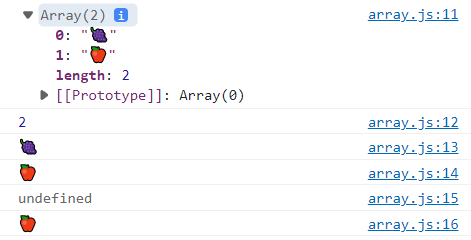
    - 배열에서 대괄호를 이용해서 데이터로 접근할 수 있음
    - object에서는 key라는 string을 이용하게 되면 그에 상응하는 value를 받아올 수 있음
    - index를 전달하게 되면 index에 해당하는 value를 받아올 수 있음
    - 그 밖에 있는 index를 접근하게 되면 `undefined` 나옴
    - 보통 배열의 첫번째 아이템을 찾을 때는 0을 많이 쓰고 제일 마지막에 있는 아이템을 찾을 때는 `fruits.length - 1`로 접근


## Looping

- 배열 안에 들어있는 전체적인 데이터를 빙글빙글 돌며 출력

  - for loop 사용

    - ```
      // a. for
      for (let i = 0; i < fruits.length; i++) {
          console.log(fruits[i]);
      }
      ```

    - 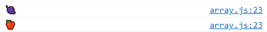

  - for of 사용

    - ```
      // b. for of
      for (let fruit of fruits) {
          console.log(fruit);
      }
      ```

    - 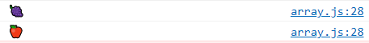

  - forEach 사용

    - ```
      forEach(callbackfn: (value: T, index: number, array: T[]) => void, thisArg?: any): void;
          /**
           * Calls a defined callback function on each element of an array, and returns an array that contains the results.
           * @param callbackfn A function that accepts up to three arguments. The map method calls the callbackfn function one time for each element in the array.
           * @param thisArg An object to which the this keyword can refer in the callbackfn function. If thisArg is omitted, undefined is used as the this value.
           */
      ```
    
      - array에 들어있는 값마다 우리가 전달한 callback함수를 수행
      - 2가지의 parameter가 전달되는데 첫 번째로 전달되는 곳은 콜백함수 내 전달한 함수를 value하나하나마다 호출, 두번째는 ?로 되어있으면 parameter을 전달해도 전달안해도 됨
      - 우리가 전달한 callback함수를 value마다 호추랳주고 nclalback함수에는 총 3가지의 인자가 들어옴. 첫 번쨰는 callback함수 호출하는 value, 두 번째는 그 값이 들어있는 index, 세 번째는 전체적인 배열.
    
    - 콜백함수를 받아옴
    
    - ```
      fruits.forEach(function() {
          console.log('he');
      })
      ```
    
      - 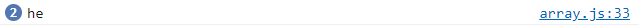
      - 데이터가 총 2개 들어있기에 he가 두번 출력
    
    - ```
      fruits.forEach(function(fruit, index, array) {
          console.log(fruit, index, array);
      })
      ```
    
      - 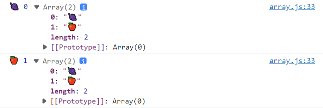
      - for each에서 보통 array는 받아오지 않음
    
    - ```
      // c. forEach
      fruits.forEach((fruit) => console.log(fruit));
      ```
    
      - 이름이 없는 fuction은 arrow함수를 사용할 수 있음
      - 한 줄만 있는 경우 괄호도 생략가능
      - 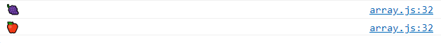


## Add, delete, copy

- value를 배열 제일 뒤에 추가

  - ```
    // push : Add an item to the end
    fruits.push['🍍','🍒'];
    console.log(fruits);
    ```

  - 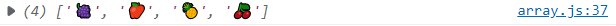

- 배열에서 제일 뒤에서부터 item 지우기

  - ```
    // pop : remove an item from the end
    fruits.pop();
    fruits.pop();
    console.log(fruits);
    ```

  - 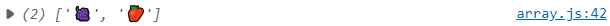

- 앞에서부터 item 넣기

  - ```
    //unshift: add an item to the benigging
    fruits.unshift('🍍','🍇');
    console.log(fruits);
    ```

  - 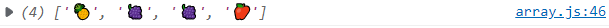

- 앞에서부터 item 빼기

  - ```
    // shift: remove an item from the benigging
    fruits.shift();
    fruits.shift();
    console.log(fruits);
    ```

  - 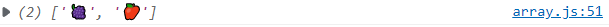

- shift와 unshift는 pop,push보다 정말 느림

  - 배열에 item들이 들어있을 때 뒷에서부터 넣고 빼는 것은 빈 공간에 data를 넣었다 지웠다 하기에 기존에 들어있던 data들은 움직이지 않아도 돼서 한 공간에 index를 이용해서 넣고 빼기가 가능하기에 빠른 operation 진행 가능

  - 앞에서 data를 넣으려면 data들을 다 이동해 텅텅 빈 공간에 data를 집어넣어야 하고 반대로 앞에서부터 data를 삭제하려면 첫 번째있는 item을 지우고 모든 data들을 땡겨야 하는 작업을 반복해서 해야하기에 배열의 길이가 길면길수록 전체적으로 움직여야되는 것들이 많기에 느려짐

  - 제일 뒤에서 item을 접근하는 것은 정말 빠르고 중간에 data를 빼고 넣는것도 index를 활용해서 하기에 빠름. 하지만 무언가 배열의 전체의 data가 움직여야된다 전체의 data들이 shift되는 operation 기능들을 느릴 수 밖에 없음

  - ```
    // note!! shift, unshift are slower than pop, push
    ```

    - item을 지정된 position에서 지우는 것 가능

      - ```
        //splice: remove an item by index position
        fruits.push('🍍','🍇','🍉');
        console.log(fruits);
        fruits.splice(1, 1);
        console.log(fruits);
        fruits.splice(1, 1, '🍈', '🥥');  // splice한 다음에 원하는 데이터를 더 추가할 수 있음
        console.log(fruits);
        ```

      - splice라는 api를 쓰면 지정된 위치에서  data 삭제 가능

      - 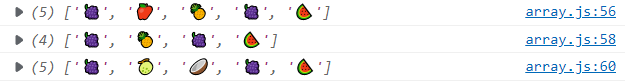

      - `splice(start: number, deleteCount?:number):string[]`

        - ? : optional

        - 지우려고 하는 갯수를 말하지 않으면? 지정한 index부터 모든 data를 지움

        - ```
          fruits.push('🍍','🍇','🍉');
          console.log(fruits);
          fruits.splice(1);
          ```

        - 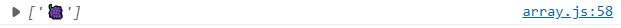

      - `fruits.splice(1, 0, '🍈', '🥥');`: 지우지않고 원하는 부분에 data를 넣을 수 있음

- 두 개의 배열을 묶을 수 있음

  - ```
    //combine two arrays
    const fruits2 = ['🍌', '🍑'];
    const newFruits = fruits.concat(fruits2);
    console.log(newFruits);
    ```

  - 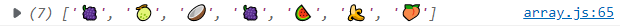

  - ```
    concat(...items: ConcatArray<T>[]): T[];
        /**
         * Combines two or more arrays.
         * This method returns a new array without modifying any existing arrays.
         * @param items Additional arrays and/or items to add to the end of the array.
         */
    ```

  - 배열 아래 있는 concat이라는 api는 새로운 배열들을 받음


## Searching

- 검색할 수 있는 api. 배열 안에 어떤 값이 몇 번째 index에 있는 지 알고싶을 때 유용하게 사용

  - ```
    // indexOf: find the index
    console.log(fruits);
    console.log(fruits.indexOf('🍍'));   // 없는 값은 -1 출력
    console.log(fruits.indexOf('🍇'));
    console.log(fruits.indexOf('🥥'));
    console.log(fruits.indexOf('🍉'));
    ```

    - fruits안에 몇 번째 index에 있는 지 알고싶을 때
    - 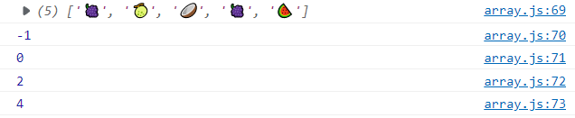

- 배열에 있는지 없는지를 true, false로 return

  - ```
    // includes
    console.log(fruits.includes('🥥'));
    console.log(fruits.includes('🍡'));
    ```

  - 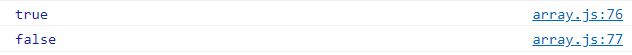

- 똑같은 data가 하나 더 있는 경우에

  - ```
    // lastIndexOf
    console.log(fruits);
    console.log(fruits.indexOf('🍇'));
    console.log(fruits.lastIndexOf('🍇'));
    ```

  - 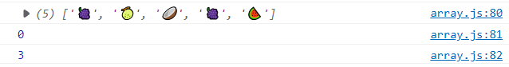

  - indexOf : 제일 첫번째로 해당하는 값을 만나면 그 값이 들어있는 index를 return

  - lastIndexOf : 제일 마지막에 들어있는 값을 return
