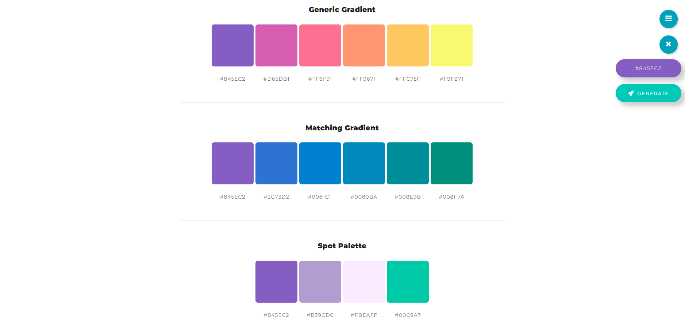
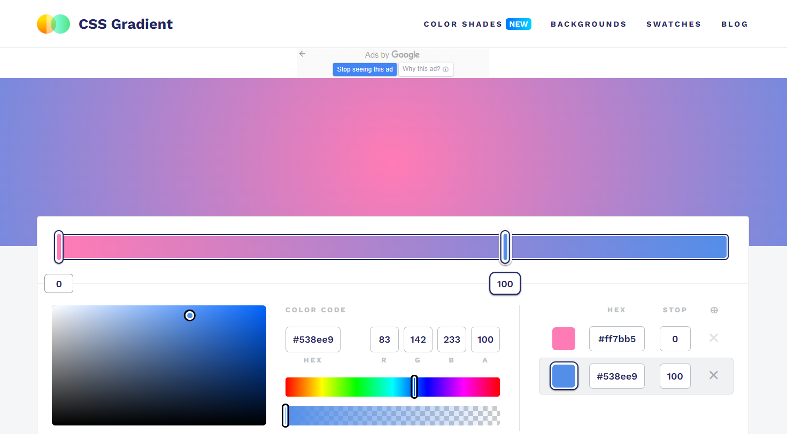
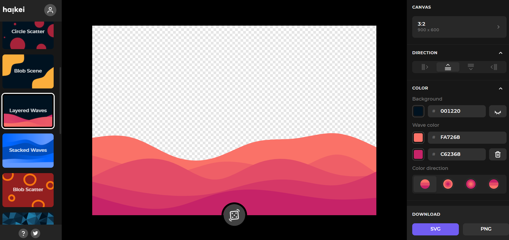

## 웹사이트 디자인

[웹사이트, 모바일 앱 디자인 무료 툴]: https://www.youtube.com/watch?v=0Pwxh1XL-Fk&amp;t=1s

[포트폴리오 관리법]: https://www.youtube.com/watch?v=3xRpjLZUBeo&amp;t=358s

## 1. 색상 팔레트

[색상팔레트]: https:///mycolor.space/

- 웹사이트 만들 때 color 팔레트를 쉽게 만들 수 있는 툴
- 주된 color가 결정됐다면 그 외 맞는 팔레트를 보여주며 여러 조합으로 나머지 색상들을 찾을 수 있음

- 
- 

## 2. 그레디언트

[그레디언트]: https://cssgradient.io/

- 시각적으로 확인하며 원하는 그레디언트를 만들 수 있음

- 

## 3. Shape Divider

[Shape Divider]: https://shapedivider.app

- 다양한 shape로 height, width 등을 설정해 원하는 모양을 시각적으로 확인 가능
- 

## 4. 다양한 SVG

[Haikei]: https://haikei.app/

- 조금 추상적인 SVG를 만들 수 있음
- 

## 5. 배경이미지

[Cool Backgrounds]: https://coolbackgrounds.io

- 다양한 패턴의 독특한 배경이미지
- 

## 6. Dribble

[Dribble]: https://dribbble.com/

- websites, Responsive website 검색

- 다양한 디자인 확인 가능. 좋은 아이디어 얻을 수 있음.
- Web Design - Popular : 현재 뜨고 있는 디자인 확인가능
- filter tap - price:0 검색 : 무료로 제공되는 그래픽 요소 확인 가능

- 

## 7. Responsive website

[pinterest]: https://www.pinterest.co.kr/search/pins/?rs=ac&amp;len=2&amp;q=responsive%20website&amp;eq=responsive%20web&amp;etslf=5543&amp;term_meta=responsive%7Cautocomplete%7C0&amp;term_meta=website%7Cautocomplete%7C0

- 핀터레스트 - Responsive website 검색
- 포트폴리오 웹사이트, 프로젝트들 물색
- 라이브 데모가 추가되어있는 경우 실제로 웹사이트가 어떻게 만들어져있는지 확인가능
- 레이아웃 그대로 들고와 컨텐트만 바꿀 수 있음
- box가 안보인다면 developer tool로 어떻게 나뉘어져있는지 확인

- 

## 8. codepen

[codepen]: https://codepen.io/

- html, css, JavaScript만으로 애니메이션 구현
- 
